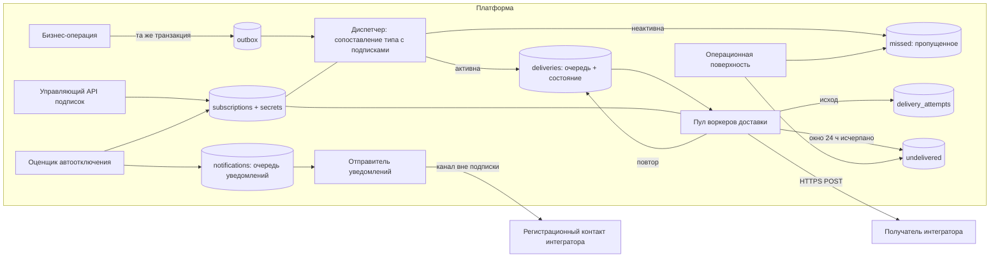

# Дизайн системы: платформа доставки вебхуков

| Поле | Значение |
|---|---|
| type | System design document (зона 2, узел `architect`) |
| status | review |
| owner | архитектор (роль исполняется замещением, канал оператора закрыт - см. журнал решений) |
| updated | 2026-08-03 |
| ревизия | 1 |
| источники | `docs/handoff-zone1-to-zone2.md`; `docs/requirements/webhooks-requirements.md` (rev.4, `review`); `docs/brd/webhooks-brd.md` (rev.11, `review`); `docs/stories/webhooks-stories.md` (rev.2, `review`); `docs/brd/webhooks-decision-log.md` (P-01..P-37, A-RA1..A-RA8, SW-1..SW-5) |
| решения этого документа | журнал решений, раздел «Решения architect (зона 2)», серия `AR-01..AR-24` |
| порог статуса | `approved` недостижим: апрув уполномоченной стороны замещён дирижёром (отступление контура, журнал решений, преамбула), судья зоны 2 (`design-reviewer`) на момент выпуска не вызван. Состав по рецепту узла заполнен целиком, пустых разделов нет - отсюда `review`, не `draft` |

`status` этой шапки - публикационный цикл документа (`draft`/`review`/`approved`/`archived`), не словарь
статуса узла (`complete`/`partial`/`blocked`). Носители разные (находка F19 журнала).

---

## 1. Приёмка входа (отдельно от качества артефактов)

Проверка комплектности пакета зоны 1 по полям handoff (`node-contract`, раздел C п.10). Вход принят
пакетом `docs/handoff-zone1-to-zone2.md`, не россыпью файлов.

| Поле входа | Состояние | Примечание |
|---|---|---|
| `status` зоны 1 | есть, `complete` | |
| `mode` | есть, `autonomous` | канал оператора замещён дирижёром |
| `publish` | есть, `false` | outward-действия не выполнялись |
| путь к журналу решений | есть, файл достижим | `docs/brd/webhooks-decision-log.md`, 966 строк, P-01..P-37 на месте |
| расположение корпуса | есть, все 4 артефакта достижимы с указанными ревизиями | BRD rev.11, требования rev.4, истории rev.2 |
| `requirements R/I` | есть | `FR-001..FR-020`, `NFR-001..NFR-011`, каждое с `traced from` |
| `acceptance criteria` | есть | 29 историй, AC в Given-When-Then с метками `[FR-NNN]` |
| `success criteria` | есть | числовые обещания `NFR-001..NFR-005`, срок хранения, срок уведомления |
| `non-goals` | есть | 7 позиций, перенесены в раздел 12 |
| `key decisions` | есть | таблица P-01..P-37 + перечень необязывающих допущений `A-RA4/5/6` |
| `constraints/risks` | есть | включая C-11 (разрешён с ценой) |
| `assumptions` | есть | `A-RA*`, `SW-1..SW-5` |
| `quality-checks` | есть, 7 записей судьи | перенесены в раздел 15 без изменений |
| требуемые артефакты документации | есть в задании узла | дизайн-документ + запись в журнал; ADR - следующему узлу |

**Расхождения, найденные приёмкой:**

1. **Порог `status: approved` для BRS не достигнут** (`node-contract`, «Готовность артефакта»: для BRS
   и ADR входной метки `quality-checks` мало). BRD - `review`. Норма предписывает в `autonomous`
   вернуть `status: blocked`; здесь это **не** сделано, и вот почему: отступление контура записано в
   журнале решений как действующее решение на весь прогон («порог `approved` требует зафиксированного
   апрува уполномоченной стороны - здесь он зафиксирован замещением, и это названо явно, а не скрыто
   статусом»). Развилка закрыта до предъявления (правило «развилка сверяется с журналом»), повторно её
   не открываю. Следствие названо явно: дизайн построен на **не апрувленной** бизнес-основе, и при
   появлении настоящего апрува содержание BRD может измениться - цена в разделе 13, строка `X-1`.
   Исход узла из-за этого - `partial`, не `complete`.
2. **Норматив состава этапа требований (системный уровень) закрыт `unverifiable`** в пакете входа
   (задел каталога). Проверку полноты набора это не отменяет: `requirement-set-quality` по набору дал
   `passed`, и на него я опираюсь без дублирования обхода.
3. Не сверено из-за отсутствия корпуса проекта: существующие `FR`/`NFR`, ADR и конвенции платформы -
   их нет (greenfield, подтверждено зоной 1 и повторно разделом 2). Нумерация локальная.

**Входная приёмка по метке (`node-contract` п.9).** `quality-checks` несёт `{BRD | requirements |
stories, requirement-quality, passed}` и `{requirement-set, requirement-set-quality, passed}` от судьи
зоны 1, ни одного артефакта не писавшего. Полный обход оракула требований здесь не дублирую (доверие
метке). Находки, возникшие вопреки метке, названы разделом 14 - на статус самой метки они не влияют
(это дыры непокрытого пути, вскрытые проектированием, а не опровержение вердикта; ни одна не делает
требование невыполнимым).

---

## 2. Контекст проекта (Phase 0)

Recall sources: `CLAUDE.md` проекта - нет; init-сообщения о стеке - нет; прежний диалог - нет; VCS -
нет. Поиск корпуса по стандартным местам выполнен зоной 1 дважды (`project-docs-map`) и повторён здесь
листингом рабочей директории: в ней только `docs/brd`, `docs/requirements`, `docs/stories`,
`docs/handoff-*`, `RUN-*`. Кода, манифестов сборки и ADR нет.

**Вывод: greenfield.** Стек не задан ни требованиями, ни BRD (транспорт HTTP POST + JSON - единственное
технологическое ограничение, допущение A1). Документ стек-нейтрален: называются классы средств
(реляционная СУБД с транзакциями и SKIP LOCKED, HTTP-клиент с контролем DNS-резолва, KMS/Vault-класс
хранилище ключей), не конкретные продукты. Там, где нужен пример - он помечен как пример.

Принятые решения проекта, действующие как норма: P-01..P-37 журнала (перекрывают любой вывод из
соседнего кода - кода нет), правила П-1..П-11 BRD. `Accepted` ADR: ни одного, корпус пуст.

---

## 3. Требования, задающие форму решения (Phase 1, сводка)

Полный текст - в источниках; здесь ось, по которой требование давит на дизайн.

| Ось | Значение | Давление на дизайн |
|---|---|---|
| Гарантия | at-least-once, порядок не гарантирован (P-01, П-1, П-2) | дедупликация не нужна на нашей стороне, нужна durability и уникальность `event_id`; получатель идемпотентен |
| Своевременность | p95 <= 5 с от события до первой попытки (`NFR-001`) | бюджет очереди, а не только сети; повторы не имеют этого SLO и обязаны уступать первым попыткам |
| Полнота | >= 99.5% за сутки; 0% безвозвратных потерь в 7 суток (`NFR-002`, `NFR-006`) | durable-хранилище на пути события до подтверждения; удаление только по retention |
| Повторы | >= 8 попыток за 24 ч, интервал неубывающий (`NFR-003`) | планировщик с явной кривой; джиттер ограничен так, чтобы не нарушить монотонность |
| Ёмкость | 500 000 событий/сут при 50 активных подписках (`NFR-004`) | раздел 4 |
| Изоляция | отказ одной подписки не даёт измеримой деградации p95 остальных (`FR-004`, `NFR-005`) | раздел 8.4 - механизм, а не декларация |
| Данные | тело - ровно 5 полей активной версии; метаданные доставки - заголовками; носитель не снимает П-10 (`FR-002`, `FR-012`, P-28) | запрет на «удобные» заголовки вида `X-Event-Type` |
| Подлинность | подпись + различение штатного повтора и воспроизведения (`FR-012`, `BR-004`) | `delivery_id` уникален **на попытку**, не на пару (событие, подписка) |
| Недоверенный ввод | адрес получателя, SSRF-защита с повторной проверкой на момент отправки (`FR-011`, `SW-3`) | резолв + пин IP + запрет редиректов |
| Конкурентность | изменение поверх устаревшего представления отклоняется с причиной; тихая потеря запрещена (`FR-008`, P-32) | механизм - решение этой зоны (раздел 8.6) |
| Версионирование | версия схемы покрывает тело и метаданные целиком (P-29); 90 суток на плановое прекращение, экстренная ветвь по мере безопасности (P-30, P-33) | версия закрепляется на подписке; двойная подпись в период сосуществования |
| Мультиарендность | интегратор видит только свои подписки (`NFR-008`) | `integrator_id` в каждой сущности и в каждом запросе |
| Секрет | не восстановим при компрометации хранилища, предъявляется один раз (`NFR-007`) | раздел 8.7 - почему это шифрование, а не хеш |
| Наблюдаемость | лог попыток (3 категории исхода), аудит операций и уведомлений, доля + время исключения с признаком вырожденного знаменателя (`NFR-010`, `NFR-011`, `FR-020`) | отдельные таблицы, а не «логи в файле» |

Команда, сроки и бюджет не назначены (P-09). Это принятое состояние, а не пробел; дизайн выбирает
решение, посильное малой команде (раздел 6), поскольку основание для обратного отсутствует.

---

## 4. Ёмкость (Phase 2)

Все цифры - back-of-envelope с явными допущениями. Пиковый коэффициент 5x к среднему (события бизнес-
операций сосредоточены в рабочих часах; при 8-часовом рабочем окне и внутридневных всплесках 5x -
консервативная верхняя оценка обычного дня).

**Ключевое допущение - fan-out** (`AR-22`): `NFR-004` называет ёмкость в **событиях**, а нагрузка на
доставку измеряется в **доставках** = события x число подписок, которым событие подходит по типу.
Материал этого множителя не называет. Принято: средний fan-out 3, верхняя граница 50 (все подписки на
все типы). Цена ошибки названа в разделе 13; находка к требованию - раздел 14, `F-AR-2`.

| Метрика | Формула | Значение (fan-out 3) | Верхняя граница (fan-out 50) |
|---|---|---|---|
| События, avg | 500 000 / 86400 | 5.8 соб/с | то же |
| События, peak | avg x 5 | 29 соб/с | то же |
| Первые попытки доставки, avg | события x fan-out | 17.4 /с (1.5 млн/сут) | 290 /с (25 млн/сут) |
| Первые попытки доставки, peak | avg x 5 | 87 /с | 1450 /с |
| Попытки всего, avg (штатно) | первые x 1.05 (99% успех с первой) | 18.3 /с | 305 /с |
| Попытки всего, avg (одна отравленная подписка на 10% трафика) | + 10% x 9 попыток | ~34 /с | ~440 /с |
| Полоса, peak | попытки x 0.9 КБ (тело ~0.3 КБ + заголовки ~0.4 КБ + ответ ~0.2 КБ) | ~78 КБ/с (0.6 Мбит/с) | ~1.3 МБ/с (10 Мбит/с) |
| Рост хранилища, 7 суток (окно retention) | события 0.1 ГБ/сут + доставки 0.4 ГБ/сут + попытки 0.35 ГБ/сут, x1.5 на индексы | ~9 ГБ | ~150 ГБ |
| Агрегаты (13 мес) | 50 подписок x 24 ч x ~100 Б | ~50 МБ | ~50 МБ |
| Read:write конвейера | claim-чтения индексные, записи 2 на доставку | write-heavy, ~1:2 | то же |

**Что из этого следует.**

1. **Шардирование не нужно** и на верхней границе: 1450 записей/с пикового - в пределах одного узла
   реляционной СУБД с посуточным партиционированием горячих таблиц. Порог пересмотра назван в разделе 9.
2. **Внешний кеш не нужен.** Горячее чтение на пути доставки - строка подписки (50 строк, помещаются в
   память процесса) и секрет. Данные, влияющие на маршрут доставки (состояние, адрес, состав типов),
   читаются в claim-запросе join'ом, чтобы приостановка и смена адреса вступали в силу немедленно;
   кешируется только секрет, TTL 60 с с инвалидацией по `version` (`AR-23`). Цена: смена секрета
   вступает в силу до 60 с - покрыта окном перекрытия 24 ч (`FR-009`).
3. **Бюджет задержки под `NFR-001`** (p95 <= 5 с): фиксация события в outbox <= 0.1 с (та же
   транзакция), подхват диспетчером <= 0.3 с (notify + poll 200 мс), fan-out и вставка доставок <= 0.1 с,
   claim воркером <= 0.5 с, установление соединения и отправка <= 1 с (p95 публичной сети). Итого ~2 с,
   запас 3 с (60%). Запас расходуется ожиданием в очереди, поэтому пул воркеров держится на утилизации
   <= 50% в пик.
4. **Размер пула воркеров.** Пик 87 доставок/с x 0.3 с средней длительности успешной попытки = 26
   одновременных. Отравленная подписка держит слот 10 с (таймаут). При лимите 4 одновременных попыток на
   подписку (раздел 8.4) даже полный отказ всех 50 подписок занимает 200 слотов. Пул - 256 слотов
   асинхронного I/O (`AR-24`): на верхней границе fan-out он же требует горизонтального добавления
   процессов-воркеров, а не изменения модели (воркеры stateless, координация через claim в СУБД).

---

## 5. Совпадение с эталонной архитектурой (Phase 3)

Задача - композиция трёх известных паттернов, ни один не покрывает её целиком:

| Эталон | Что берём | Что адаптируем под требования |
|---|---|---|
| **Webhook delivery** (at-least-once, backoff, DLQ) | ядро: очередь доставок, повторы, DLQ, подпись тела, верификация владения адресом | стандартный экспоненциальный backoff с полным джиттером **не годится**: `NFR-003` требует неубывающего интервала (раздел 8.3). Стандартный DLQ «навсегда» заменён сроком хранения 7 суток (П-7) |
| **Notification / fan-out** | порождение N доставок из одного события, транзакционный outbox | fan-out мал (десятки), поэтому write fan-out на запись, без предвычисленных лент |
| **Job queue / scheduler** | claim-lease, отложенный повтор, приоритеты | приоритет двухклассовый: первые попытки (несут SLO `NFR-001`) старше повторов (SLO не несут) |
| **CRUD service with workflow** (управляющий API) | жизненный цикл подписки как явная машина состояний | состояние `pending_verification` обязательно (`FR-010`, П-8); переходы фиксируются аудитом (`NFR-010`) |

Уникального в задаче два места, где типовой webhook-паттерн молчит: **изоляция подписок как измеримое
требование** (`NFR-005`, обычно решается «просто добавь воркеров») и **версионирование контракта
доставки целиком, включая метаданные** (P-29; обычно версионируется только тело). Оба разобраны в
Deep Dive отдельно.

---

## 6. Альтернативы (Phase 4)

Общее для всех трёх: транзакционный outbox в исходной бизнес-операции - иначе `NFR-002` (0%
безвозвратных потерь) неисполним никаким выбором очереди, потому что потеря происходит между коммитом
бизнес-операции и публикацией события.

### Альтернатива A. Модульный монолит, очередь доставок в реляционной СУБД

Один deploy-unit, две роли процесса (API и воркер доставки), одна СУБД. Очередь доставок - таблица,
claim через `FOR UPDATE SKIP LOCKED` с лизом; отложенный повтор - `next_attempt_at`; DLQ, пропущенное,
лог попыток, аудит - таблицы той же СУБД. Брокер не вводится.

Лучше других в одном: **все инварианты задачи транзакционны в одном хранилище** - «событие ->
N доставок» атомарно, состояние подписки и решение о маршруте читаются в том же запросе, что и claim,
а «неубывающий интервал в 24-часовом окне» выражается полем `next_attempt_at`, а не эмулируется
средствами брокера.

### Альтернатива B. Сервисы + брокер с очередью на подписку

`subscription-api`, `dispatcher`, `delivery-worker`, `retry-scheduler` как отдельные сервисы; брокер
(например, AMQP) с очередью на каждую подписку, повторы через ретрай-очереди с TTL, DLQ - очередью
брокера. Изоляция получается «бесплатно» топологией: очередь на подписку физически не блокирует чужую.

Лучше других в одном: **изоляция и горизонтальный рост доставки** - при росте fan-out на порядок
топология не меняется, добавляются консьюмеры.

### Альтернатива C. Управляемые облачные примитивы

Шина событий -> тема -> очередь на подписку -> функция-отправитель; DLQ и повторы - настройками
очереди; реестр подписок - управляемая БД.

Лучше других в одном: **минимум эксплуатации** - ретраи, DLQ и масштабирование не пишутся.

---

## 7. Решение (Phase 5)

**Выбрана альтернатива A - модульный монолит с очередью доставок в реляционной СУБД.**

Свёрнутая форма Output неприменима: система несёт горизонтально масштабируемый пул воркеров, реплику
СУБД, смешение оперативной и аналитической нагрузки (доля доставленного за 30 суток) и распределённую
запись «наша транзакция + чужой HTTP» - четыре признака чек-листа из шести нарушены. Развёрнуто:

**Связь с ограничениями и цифрами.**

- При пиковых 87 доставках/с (раздел 4) пропускная способность не является различающим фактором: обе
  альтернативы A и B перекрывают требуемое с запасом в два порядка. Различает **стоимость владения**:
  команда не назначена (P-09), и вводить брокер ради нагрузки, которую держит СУБД, значит покупать
  вторую систему хранения с собственной durability, мониторингом и режимами отказа.
- `NFR-002` («0% безвозвратно утраченных») в варианте B требует двухфазного согласования между СУБД и
  брокером либо своего outbox поверх брокера - то есть outbox всё равно остаётся, а брокер добавляется
  сверху. В варианте A outbox и очередь - одно хранилище, и «потери между двумя системами» не существует
  как класса отказа.
- `NFR-003` (неубывающий интервал, >= 8 попыток за 24 ч) в брокере выражается цепочкой ретрай-очередей
  с фиксированными TTL - по очереди на ступень графика; изменение кривой становится изменением
  топологии. В варианте A это строка расписания и поле `next_attempt_at`.
- `FR-008`/P-32 (отклонение изменения поверх устаревшего представления) требует единого носителя истины
  о состоянии подписки с версией. В A это одна строка; в B и C - реестр в БД плюс кеш маршрутизации в
  брокере, которые расходятся, и «доставка ушла по старому адресу после подтверждённой смены» становится
  штатно возможной.

**Позиция CAP.** При сетевом разделении выбираем **согласованность, а не доступность (CP)** для
состояния подписки и конвейера доставки: сторона без первичного узла СУБД записи не принимает
(управляющий API отвечает 503, конвейер приостанавливает выдачу задач). Основание прямое:
`FR-008` запрещает тихую потерю параллельного изменения, а две расходящиеся копии состояния подписки
делают это требование неисполнимым в принципе; `NFR-006` явно разрешает нарушить своевременность и
запрещает потерю. Доступность жертвуем осознанно: пауза доставки на время разделения превращается в
задержку, которая догоняется после восстановления, а расхождение состояния подписки не «догоняется»
никогда.

**Позиция PACELC** - по операциям, а не одна на систему:

| Операция | PACELC | Почему |
|---|---|---|
| Запись и чтение состояния подписки (управляющий API) | PC/EC | read-your-writes обязателен: интегратор получает `ETag` и немедленно шлёт с ним `If-Match`; чтение с отстающей реплики выдало бы 412 на корректный запрос. Чтения идут с первичного узла |
| Конвейер доставки (claim, фиксация исхода) | PC/EC | claim с реплики нарушает лиз и множит одновременные попытки сверх лимита изоляции |
| Наблюдаемость: доля доставленного, перечни для разбора, дашборды | PA/EL | отставание реплики на секунды не задевает ни одно требование: `FR-020` требует обновления не реже раза в сутки |

Репликация: одна синхронная реплика в другой зоне доступности для RPO=0 под `NFR-002`. **Ловушка,
названная явно:** при единственном синхронном standby его отказ останавливает коммиты первичного узла -
то есть защита durability превращается в отказ доступности. Поэтому кворум задаётся как «любая 1 из 2»
кандидатов-реплик (`AR-19`); цена - три узла СУБД вместо двух.

**Что отвергаем.**

- **B (брокер, очередь на подписку).** Отвергнута не по существу изоляции - она в B действительно
  дешевле, - а по совокупности: вторая durable-система под нагрузку, которую держит первая; график
  повторов в топологии вместо данных; расхождение реестра подписок и маршрутизации. Цена отказа:
  изоляцию приходится строить самим (раздел 8.4), и она становится предметом нагрузочного теста, а не
  свойством топологии.
- **C (управляемые примитивы).** Отвергнута по трём проверяемым несовпадениям: (1) политика повторов
  управляемых очередей задаётся экспонентой провайдера, а `NFR-003` требует именно неубывающего
  интервала с гарантированным числом попыток в фиксированном окне; (2) `FR-011`/`SW-3` требуют
  повторной проверки резолва **на момент отправки** и запрета редиректов - это контроль над HTTP-
  клиентом, которого управляемая функция-отправитель провайдера не даёт; (3) привязка к поставщику при
  отсутствии решения о площадке. Цена отказа: эксплуатация ретраев, DLQ и масштабирования - наша.
- **Микросервисная декомпозиция варианта A** (тот же дизайн, но 4 сервиса). Отвергнута: границы
  транзакций прошли бы по местам, где требуется атомарность (событие -> доставки, состояние -> маршрут),
  что даёт распределённый монолит с сагой там, где сейчас один коммит.

**Что теряем осознанно.**

1. Потолок пропускной способности ниже, чем у брокерного варианта. Пороги пересмотра назначены числом
   (раздел 9.11), решение обратимо: конвейер отделён интерфейсом «источник задач доставки», подмена
   реализации на брокер не задевает ни контракт доставки, ни управляющий API.
2. Изоляция подписок - наш код и наш нагрузочный тест, а не свойство инфраструктуры. Риск ошибки в
   механизме закрывается обязательным тестом `NFR-005` в релиз-гейте, а не рассуждением.
3. Единый первичный узел СУБД - единая точка отказа записи. Под partition система теряет доступность
   (см. CAP). Принято.
4. Смешение оперативной нагрузки и расчёта доли за 30 суток в одном хранилище. Смягчено: расчёт идёт по
   часовым агрегатам с реплики, не по сырым попыткам первичного узла.

---

## 8. Deep Dive (Phase 6)

### 8.1. Границы и два контракта

Модули (границы транзакций и владения данными; в варианте A - внутренние, но с явным контрактом):

| Модуль | Владеет | Не владеет |
|---|---|---|
| Subscriptions | реестр подписок, секреты, верификация владения адресом, аудит операций | решением о доставке |
| Delivery | outbox-курсор, очередь доставок, попытки, DLQ, пропущенное | состоянием подписки (читает) |
| Contract lifecycle | версии схемы, объявления о прекращении, выпуски по исключению, уведомления | доставкой |
| Metering | часовые агрегаты, доля доставленного, время исключения, база опросной нагрузки | сырыми попытками (читает с реплики) |
| Ops surface | перечни недоставленного и пропущенного, ручная переотправка | публичным контрактом интегратора |

**Разведение контрактов - жёсткое.** Их три поверхности, а не две: задание называет два внешних, третья
внутренняя и потому легко смешивается с интеграторским API - это ошибка, которую дизайн закрывает
явно, потому что `FR-007` (ручная переотправка) и `FR-013` (восстановление пропущенного) намеренно
разведены по сторонам постановщиком (П-27/BA-31).

**Контракт 1 - исходящий webhook (платформа -> получатель).** Обязан нести по требованиям:

- транспорт: HTTPS POST, JSON-тело (A1; https - решение `AR-11`, см. 8.8);
- тело: ровно поля активной версии схемы, сегодня пять - `event_id`, `event_type`, `entity_id`,
  `occurred_at`, `schema_version` (`FR-002`); нижняя граница (непустой `event_id`) версионно-независима;
- метаданные доставки - только заголовками (`FR-012`): признак подлинности, идентификатор доставки,
  метка времени доставки;
- **запрет**: ни один заголовок не несёт сведений о событии, сущности или интеграторе (П-10, P-28).
  Практическое следствие, которое легко нарушить по привычке: заголовки вида `X-Event-Type`,
  `X-Entity-Id`, `X-Subscription-Name` в контракт не вводятся - они дублируют тело и переносят
  раскрытие на носитель, где контроль обходится (`FR-002` verification это ловит);
- семантика ответа: подтверждение - только 2xx; всё прочее, включая таймаут ответа и отказ соединения, -
  неуспех (П-6, три категории `NFR-011`);
- редиректы не выполняются: 3xx - неуспех (8.8);
- версия схемы управляет телом **и** набором заголовков целиком (P-29);
- обязанности получателя, объявляемые документацией (`FR-014`): идемпотентность по `event_id`,
  устойчивость к перестановке, проверка подписи и допустимой давности метки времени.

**Контракт 2 - управляющий API подписок (интегратор -> платформа).** Обязан нести:

- аутентификацию интегратора и авторизацию только над своими подписками (`NFR-008`);
- жизненный цикл: создание, изменение состава типов и адреса, приостановка, возврат в работу, удаление
  (`FR-008`); подтверждение владения адресом как отдельный ресурс (`FR-010`);
- замену секрета с окном перекрытия и однократной выдачей значения (`FR-009`, `NFR-007`);
- перечень пропущенного для восстановления интегратором (`FR-013`), **без** операции переотправки
  недоставленного - она принадлежит операционной поверхности (`FR-007`);
- оптимистичную конкурентность: `ETag` на представлении, `If-Match` обязателен на изменяющих операциях,
  отказ с названной причиной (`FR-008`, P-32; механизм - 8.6);
- идемпотентность создания (ключ идемпотентности), курсорную пагинацию перечней (пропущенное за 7 суток
  на активном интеграторе - сотни тысяч записей, offset-пагинация здесь неприменима);
- ограничение частоты создания и верификации (`NFR-009`) с наблюдаемым для клиента исходом;
- **свою ось версионирования, независимую от версии схемы доставки.** Смешение осей - типовая ошибка:
  версия API управляет формой управляющих ресурсов, версия схемы - формой оповещения; они меняются по
  разным причинам и в разные моменты.

**Поверхность 3 - операционная (эксплуатация).** Перечни недоставленного и пропущенного с причиной
(`FR-006`), ручная переотправка недоставленного (`FR-007`), доля доставленного рядом со временем
исключения (`FR-020`), аудит (`NFR-010`). Аутентификация - внутренняя, роли эксплуатации; в публичный
контракт интегратора не входит.

Детальные спецификации обеих внешних поверхностей пишет следующий узел зоны 2 (`api-designer`); здесь
заданы границы, ответственность и обязательное содержание.

### 8.2. Схема хранения

Реляционная СУБД, одна база, посуточное партиционирование горячих таблиц. Ключи - UUIDv7 (монотонность
по времени даёт локальность вставки и упорядоченность по времени без отдельного индекса).

| Таблица | Ключ / уникальность | Существенные поля | Индексы и партиционирование |
|---|---|---|---|
| `subscriptions` | PK `id`; UNIQUE (`integrator_id`, `endpoint_url`, active) | `integrator_id`, `state` (`pending_verification`/`active`/`paused`/`disabled`), `endpoint_url` (подтверждённый), `pending_endpoint_url`, `schema_version`, `version` bigint, `last_success_at`, `disabled_at`, `disabled_reason` | (`integrator_id`), (`state`) |
| `subscription_event_types` | PK (`subscription_id`, `event_type`) | - | (`event_type`, `subscription_id`) - вход диспетчера |
| `subscription_secrets` | PK `secret_id` | `subscription_id`, `secret_ciphertext`, `key_id` (KMS), `valid_from`, `valid_until` | (`subscription_id`, `valid_until`) |
| `endpoint_verifications` | PK `id` | `subscription_id`, `candidate_url`, `token_hash`, `expires_at`, `state` | (`subscription_id`) |
| `events` | PK `event_id` | `event_type`, `entity_id`, `occurred_at`, `schema_version` | партиции по суткам `occurred_at`, retention 7 суток |
| `outbox` | PK `id` | `event_id`, `created_at`, `dispatched_at` | частичный индекс WHERE `dispatched_at IS NULL` |
| `deliveries` | PK `id`; **UNIQUE (`event_id`, `subscription_id`, `origin`)** | `state` (`pending`/`in_flight`/`succeeded`/`undelivered`), `attempt_no`, `next_attempt_at`, `window_expires_at`, `priority` (0 - первая попытка, 1 - повтор), `lease_owner`, `lease_until`, `origin` (`auto`/`manual_resend`) | **частичный индекс (`priority`, `next_attempt_at`) WHERE state IN (`pending`) - единственный горячий индекс claim'а**; партиции по суткам `created_at` |
| `delivery_attempts` | PK (`delivery_id`, `attempt_no`) | `started_at`, `outcome_class` (`http_status`/`response_timeout`/`connect_error`), `http_status`, `error_detail`, `duration_ms` | партиции по суткам, retention 7 суток |
| `missed_events` | PK (`subscription_id`, `event_id`) | `occurred_at`, `reason` = `subscription_inactive` | партиции по суткам, retention 7 суток |
| `delivery_stats_hourly` | PK (`subscription_id`, `hour`) | `attempted`, `delivered`, `undelivered`, `active_seconds`, `excluded_seconds`, `finalized` bool | retention 13 месяцев |
| `subscription_audit` | PK `id` | `subscription_id`, `actor` (`integrator`/`platform`), `at`, `prev_state`, `new_state`, `operation` | (`subscription_id`, `at`), retention 13 месяцев |
| `notification_attempts` | PK `id` | `integrator_id`, `kind` (`auto_disable`/`deprecation_planned`/`deprecation_emergency`), `subject`, `at`, `channel`, `outcome`, `attempt_no` | (`integrator_id`, `at`); **записи разных ветвей по одному предмету не объединяются** (P-33) |
| `schema_releases` | PK (`schema_version`) | `announced_at`, `sunset_at`, `emergency` bool, `security_assessed_at`, `coexistence_until` | - |
| `poll_baseline` | PK (`integrator_id`, `request_kind`, `hour`) | `count` | вход `FR-015`/`FR-016` |

**Обоснование ключевых решений схемы.**

- **`deliveries` - и очередь, и состояние.** Отдельная таблица-очередь плюс таблица-состояние дали бы
  два источника истины о том, доставлено ли событие; при at-least-once это ровно то место, где
  появляются «доставлено, но висит в очереди».
- **UNIQUE (`event_id`, `subscription_id`, `origin`)** делает fan-out идемпотентным: повторный проход
  диспетчера по тому же outbox-элементу (после падения между вставкой доставок и отметкой outbox) не
  создаёт дубль. `origin` в ключе оставляет место ручной переотправке того же события (`FR-007`).
- **`priority` в claim-индексе** отделяет первые попытки (несут `NFR-001`) от повторов (не несут). Без
  этого поля 1.35 млн повторов отравленной подписки конкурируют за воркеров с первыми попытками, и p95
  ломается ровно в сценарии, против которого написан `NFR-005`.
- **Партиционирование по суткам** превращает retention (П-7) в отсоединение партиции - операция
  константной стоимости, вместо `DELETE` на миллионах строк, который на этих объёмах даёт всплеск
  нагрузки как раз в моменты, когда система и так под давлением.
- **Ключ шардирования не назначается**: шардирование не требуется (раздел 4). Если порог пересмотра
  пройден - естественный ключ `subscription_id` (изоляция уже per-subscription, cross-shard запросы -
  только агрегаты Metering, которые и так считаются на репликах).

### 8.3. Гарантия доставки, очередь и повторы

**Путь события.**

1. Бизнес-операция платформы в своей транзакции пишет `events` + `outbox`. Это единственное место, где
   `NFR-002` (0% потерь) обеспечивается; всё, что после, - durable по построению.
2. Диспетчер читает неотправленные `outbox`, по `event_type` находит подписки (`subscription_event_types`)
   и в одной транзакции: вставляет `deliveries` для активных подписок, `missed_events` для
   неактивных (`SW-1`), отмечает `outbox.dispatched_at`. Падение между шагами безопасно: повтор
   идемпотентен по UNIQUE-ключам.
3. Воркер забирает пачку задач claim-запросом (8.4), берёт лиз (`lease_until = now + 60 с`), отправляет
   HTTP, пишет `delivery_attempts`, обновляет `deliveries`.
4. Успех (2xx) -> `succeeded`, `subscriptions.last_success_at = now`. Неуспех -> расчёт `next_attempt_at`
   по расписанию; если следующий момент выходит за `window_expires_at` (событие + 24 ч) -> `undelivered`
   (это и есть DLQ, отдельного хранилища не требуется - запись остаётся в `deliveries` с терминальным
   состоянием и партиционным retention 7 суток).

**Расписание повторов (`AR-04`).** 9 попыток в окне 24 ч, интервалы (минуты): 1, 5, 15, 45, 120, 240,
360, 480. Моменты от события: 0, 1м, 6м, 21м, 1ч06, 3ч06, 7ч06, 13ч06, 21ч06. Требование `NFR-003`
(>= 8 попыток, интервал неубывающий) выполнено с запасом в одну попытку и ~3 ч до конца окна - запас
поглощает джиттер и очередь под нагрузкой.

**Джиттер и монотонность - место, где типовое решение нарушает требование.** Отраслевой дефолт против
эффекта стада (R-6) - full jitter, случайная задержка в [0, d]. Он **нарушает** `NFR-003`: соседние
интервалы перестают быть неубывающими. Принято: ограниченный джиттер +-10% от планового интервала.
Проверка достаточности: монотонность сохраняется, если `0.9 * d(n+1) >= 1.1 * d(n)`, то есть при
отношении соседних интервалов >= 1.23; минимальное отношение в выбранной кривой - 1.33 (360 -> 480).
Условие выполняется на всех ступенях. Цена: рассеивание повторов уже 10% интервала, чего достаточно на
50 подписках, но недостаточно на тысячах получателей за одним адресом - при пересмотре кривой условие
монотонности пересчитывается заново.

**Ручная переотправка (`FR-007`, `AR-18`).** Создаёт новую строку `deliveries` с `origin =
manual_resend`, тем же `event_id` (получатель распознаёт как штатный дубль по П-1) и собственным
24-часовым окном. Она **не** продлевает срок хранения исходной записи: по истечении 7 суток исчезают
обе. Требование этого не называет - решение узла, находка `F-AR-3`.

**Пропущенное (`FR-013`, `AR-17`).** Материализуется строкой в момент события, а не вычисляется постфактум
сканированием `events` по типам за период неактивности. Основание: постфактум-скан не даёт причины
записи по построению и ломается на подписке, у которой за период менялся состав типов. Цена: запись на
каждое событие каждой неактивной подписки - верхняя граница объёма названа в разделе 4. Чтение перечня
не консумирует записи (`SW-5`).

**Удаление подписки (P-36)** удаляет `deliveries`, `missed_events`, секреты и верификации по ней
каскадом, включая не истёкшие по сроку хранения. Аудит (`subscription_audit`) переживает удаление -
иначе `NFR-010` теряет след операции удаления в момент её совершения.

### 8.4. Изоляция подписок (`FR-004`, `NFR-005`) - механизм

Отказ, от которого защищаемся, - не «одна подписка отвечает ошибкой», а три разных механизма деградации:
(а) блокировка головы общей очереди, (б) исчерпание пула воркеров медленными таймаутами, (в) вытеснение
первых попыток лавиной повторов. Одного средства недостаточно; принят трёхслойный механизм (`AR-05`,
`AR-06`).

**Слой 1 - справедливая выборка (против блокировки головы).** Claim берёт задачи не «первые N по
`next_attempt_at`», а по k задач на подписку: латеральное соединение по подпискам, имеющим готовые
задачи, с ограничением k на подписку и `FOR UPDATE SKIP LOCKED`. Одна подписка с миллионом готовых
повторов получает k мест в пачке, а не всю пачку.

**Слой 2 - переборка (bulkhead) на подписку.** Не более 4 одновременных попыток на подписку. Счётчик -
в той же транзакции claim'а (число строк подписки в состоянии `in_flight` с непросроченным лизом).
Верхняя граница занятого отравленной подпиской ресурса: 4 слота x 10 с таймаута. При пуле 256 слотов
даже одновременный отказ всех 50 подписок оставляет 56 свободных слотов (раздел 4).

**Слой 3 - размыкатель (circuit breaker) на подписку.** Порог: 20 последовательных неуспехов ->
разомкнут. В разомкнутом состоянии задачи подписки не выбираются вовсе; раз в интервал текущей ступени
расписания пропускается одна пробная попытка (полуоткрытое состояние). Успех замыкает. Цель слоя -
снять с пула даже 4 слота на заведомо мёртвом получателе и не создать эффект стада на его
восстановлении.

**Слой 0 (следствие `priority` в claim-индексе).** Первые попытки выбираются раньше повторов при равной
готовности. Это то, что удерживает `NFR-001` в момент массового отказа: SLO есть только у первой
попытки.

**Как проверяется, а не декларируется.** Релиз-гейт `NFR-005`: нагрузочный прогон на целевой ёмкости
(`NFR-004`) с одной подпиской, отвечающей таймаутом на 100% запросов. Критерий: p95 своевременности по
остальным подпискам во время отказа не отличается от p95 до отказа сверх доверительного интервала
измерения. Дополнительно - тот же прогон с 10% подписок в отказе (проверка, что деградация растёт
линейно, а не обрывом).

### 8.5. Автоотключение (`FR-005`)

Оценщик раз в минуту выбирает подписки в состоянии `active`, у которых `last_success_at < now - 24 ч`
(или `last_success_at IS NULL` при активации ранее 24 ч назад), **и** в окне была хотя бы одна
неуспешная попытка. Переход в `disabled` + запись аудита + постановка задачи уведомления - в одной
транзакции; отправка уведомления - отдельным воркером по своей очереди.

**Условие «была хотя бы одна неуспешная попытка» - решение узла (`AR-14`), а не требование.** Буквальное
чтение `FR-005` и AC `S-3.2` («за непрерывные 24 ч не зафиксировано ни одной успешной доставки»)
отключает и **простаивающую** подписку: у подписки на редкий тип события за 24 ч может не быть ни одной
доставки вообще, и «ни одной успешной» для неё истинно. Это отключило бы исправного интегратора и
превратило бы его события в пропущенные - против `BR-002`. Дизайн исполняет цель требования
(«устойчиво неисправный получатель не расходует общий ресурс»), а не букву; расхождение вынесено
находкой `F-AR-1` к `FR-005`, не правится молча.

**Уведомление (P-34, `AR-15`).** Канал - регистрационные контактные данные (P-19), не зависящие от подписки.
Отключение фиксируется независимо от исхода уведомления: задача уведомления живёт в своей таблице,
повторяется с тем же неубывающим графиком в пределах 7 суток, каждая попытка - отдельная запись
`notification_attempts` с исходом (`NFR-010`). Недоступность канала не откладывает и не отменяет
отключение - структурно: транзакция отключения не содержит сетевого вызова.

**Возврат в работу** - только явное действие интегратора через управляющий API (`FR-005`). Автоматической
реактивации по восстановлению получателя нет.

**Массовое одновременное срабатывание** (C-11: экстренная замена признака подлинности с нулевым периодом
сосуществования -> все получатели отвергают доставку -> все подписки уходят под порог) обрабатывается
той же per-подписочной моделью: оценщик работает пачкой, отключение одной подписки не ждёт уведомления
другой. Ожидаемое следствие меры безопасности, не дефект (BRD, C-11).

### 8.6. Конкурентное изменение подписки (`FR-008`, P-32)

**Выбрано: оптимистичная конкурентность по версии ресурса (`AR-07`).** `subscriptions.version`
инкрементируется на каждом изменении и отдаётся клиенту как `ETag`. Любая изменяющая операция обязана
нести `If-Match` с этим значением. Условие не совпало -> отказ 412 с телом ошибки, называющим причину
(«представление устарело»), текущую версию и текущее представление, чтобы повтор не требовал
дополнительного чтения. `If-Match` отсутствует -> отказ 428, **а не молчаливое применение**: иначе
механизм вырождается в last-write-wins для любого клиента, который просто не прислал заголовок.
Сравнение и запись - в одной транзакции (`UPDATE ... WHERE id = ? AND version = ?`), проверка на уровне
приложения без этого условия не защищает.

**Отклонённые варианты и цена.**

| Вариант | Почему отклонён | Что теряем отказом |
|---|---|---|
| Last-write-wins | прямо запрещён P-32 (тихая потеря) | - |
| Пессимистичная сериализация на ресурсе (блокировка/очередь на подписку) | конфликт не называется стороне, а маскируется ожиданием: второй запрос завершается успехом, применив изменение поверх чужого, - формально «потери» нет, фактически интегратор не узнаёт, что его представление устарело. Плюс распределённая блокировка и таймауты | простоту клиента: при сериализации клиенту не нужно ничего присылать и обрабатывать |
| Слияние изменений по полям (merge) | состояние подписки - машина состояний, а не набор независимых полей: «приостановить» и «сменить адрес» не сливаются осмысленно | автоматическое разрешение части конфликтов |
| Версия внутри тела запроса вместо `If-Match` | тот же механизм, но конфликт перестаёт быть выразимым стандартным кодом ответа и уезжает в тело; кеширующие посредники его не видят | - |

**Цена выбранного, названная явно:** операции управления перестают быть безусловно успешными -
интегратор обязан обработать 412 и повторить с актуальным состоянием (это уже принято постановщиком в
`FR-008`). Плюс: каждый изменяющий вызов требует предшествующего чтения; смягчено возвратом
представления и нового `ETag` в теле как успешного, так и отказного ответа.

**Гонка «изменение против доставки в полёте».** Разрешается не блокировкой, а моментом чтения: воркер
читает адрес, состояние и состав типов **в claim-запросе, в момент отправки**, а не на этапе постановки
задачи. Отсюда: приостановка останавливает уже поставленные, но не отправленные задачи (`SW-2`), а
смена адреса не может увести доставку на неподтверждённый адрес - см. 8.8.

### 8.7. Подлинность, различение повтора, секрет

**Подпись (`AR-08`).** HMAC-SHA256 над канонической строкой `timestamp . LF . delivery_id . LF .
raw_body`. Заголовок несёт версию схемы подписи, идентификатор ключа, метку времени и значение:
`v1,keyid=<secret_id>,t=<unix>,sig=<hex>`. Тело подписывается в сыром виде (сериализованные байты),
не переcериализованное представление - иначе получатель не воспроизведёт входные данные подписи.

- Отклонён **mTLS**: перекладывает на десятки интеграторов управление клиентскими сертификатами и их
  ротацией, не защищает от воспроизведения и не даёт интегратору самостоятельной замены средства
  (`FR-009`/`BR-003`). Цена отказа: нет взаимной аутентификации транспорта.
- Отклонена **асимметричная подпись (Ed25519)**: строго сильнее по риску компрометации нашего хранилища
  (получатель хранит только публичный ключ), но ломает модель `BR-003`/`FR-009`, где средство
  подтверждения подлинности - разделяемый секрет, заменяемый интегратором. Цена отказа названа: при
  компрометации нашего хранилища секретов подделка оповещений становится возможной для атакующего -
  отсюда обязательность 8.7 (шифрование) и путь экстренной замены механизма (P-30) как заранее
  предусмотренный, а не импровизированный.
- **Версия схемы подписи (`v1`) в заголовке обязательна с первого релиза.** Без неё экстренная замена
  механизма (P-30) неисполнима механически: получатель не отличит новый признак от испорченного старого.

**Различение штатного повтора и воспроизведения (`FR-012`).** `delivery_id` уникален **на попытку**, не
на пару (событие, подписка), и метка времени берётся на момент попытки. Отсюда:

| Наблюдаемое получателем | Смысл |
|---|---|
| тот же `event_id`, новый `delivery_id`, свежая метка | штатный повтор at-least-once - обработать идемпотентно (П-1) |
| тот же `delivery_id`, та же метка, повторно | воспроизведение перехваченного - отвергнуть |
| метка старше допуска | воспроизведение либо задержка сети - отвергнуть |

Допустимая давность метки проверяется **получателем**; рекомендуемое значение (5 минут) объявляется
документацией (`FR-014`), платформой не навязывается. Следствие для платформы: синхронизация часов
(NTP) - эксплуатационное требование, попадающее в DoD инкремента 2, иначе рекомендация 5 минут даёт
ложные отвержения.

**Хранение секрета (`NFR-007`, `AR-10`).** Секрет хранится **зашифрованным** (конвертное шифрование
ключом KMS/Vault-класса), не хешем. Причина названа, потому что формулировка `NFR-007`
(«хеширование/шифрование») допускает оба, а хеш здесь невозможен: HMAC требует исходного значения в
момент отправки. Значение предъявляется интегратору один раз - при создании и при замене; повторное
чтение не возвращает его никогда. Ключ шифрования - вне базы данных; компрометация дампа БД без доступа
к KMS не даёт секретов.

**Окно перекрытия при замене (`FR-009`).** Действительны оба секрета в течение 24 ч (`A-RA6` принято как
решение `AR-08`). В окне доставка подписывается **обоими** ключами - два заголовка подписи с разными
`keyid`; получатель принимает, если хотя бы один валиден по известному ему секрету. Альтернатива
(подписывать только новым) отвергнута: она делает окно перекрытия бесполезным для получателя, который
ещё не выкатил новый секрет.

### 8.8. Адрес получателя как недоверенный ввод (`FR-010`, `FR-011`, `NFR-009`)

**Подтверждение владения (`AR-12`).** Challenge-response: платформа отправляет на кандидатный адрес
запрос с одноразовым токеном, подписка активируется только после ответа, содержащего эхо этого токена.
Токен - 24 ч, по истечении заявка отбрасывается (`A-RA4` принято как решение). Отклонено: (а) «адрес
ответил 200» без эха - не доказывает контроль над содержимым, любой прокси отвечает 200; (б) e-mail и
DNS TXT - не соответствуют модели, где адрес есть произвольный путь URL.

**Смена адреса действующей подписки (P-35).** `pending_endpoint_url` живёт отдельным полем; доставка
идёт по `endpoint_url` (подтверждённому) до успешной верификации кандидата; после - поля меняются
местами в одной транзакции; при отказе или истечении кандидат отбрасывается, доставка не прерывалась.
Воркер читает адрес в момент отправки (8.6), поэтому переключение атомарно относительно доставок в
полёте.

**Защита от обращения во внутренние диапазоны (`FR-011`, `SW-3`, `AR-11`) - четыре слоя, потому что
каждый в одиночку обходится:**

1. **Валидация формы**: только `https`, только доменное имя или публичный IP-литерал; отвергаются
   пользовательская часть URL (`user@host`), нестандартные схемы.
2. **Проверка резолва при создании и верификации**: все A/AAAA-записи проверяются против deny-списка -
   loopback, RFC1918, link-local (включая 169.254.169.254 - адрес метаданных облака), CGNAT 100.64/10,
   0.0.0.0/8, multicast, IPv4-mapped IPv6, уникальные локальные IPv6.
3. **Повторная проверка на момент отправки с пином адреса**: перед каждой попыткой резолв повторяется,
   проверяется, и соединение устанавливается **к проверенному IP** (с сохранением имени в SNI и
   заголовке Host). Проверить и затем «просто подключиться по имени» - не защита: между проверкой и
   соединением DNS отдаёт другой адрес (DNS rebinding), что и есть TOCTOU из `SW-3`.
4. **Редиректы не выполняются**: 3xx считается неуспешной попыткой. Следование редиректу обнуляет три
   слоя выше - перенаправление на внутренний адрес обходит их все.

Пятый слой, вне приложения: сетевая политика исходящего трафика воркеров запрещает внутренние диапазоны
на L3. Приложение может содержать ошибку; сеть - последний рубеж.

**Ограничение частоты (`NFR-009`)**: создание и верификация подписок лимитируются на интегратора. Причина
именно этих операций: без лимита платформа становится усилителем - злоумышленник массово создаёт
подписки на чужой адрес и заставляет нас его опрашивать.

### 8.9. Версионирование контракта доставки и прекращение поддержки

**Единица версионирования - контракт доставки целиком** (P-29): тело, набор заголовков метаданных,
способ вычисления признака подлинности. Одна версия, одно число, `schema_version` в теле (`AR-13`).

- **Аддитивное изменение** (новый тип события, новое поле) - совместимо, выпускается в текущей версии;
  `FR-018` держится contract-тестом на старом получателе.
- **Несовместимое изменение** (переименование, изъятие, смена способа вычисления подписи) - новая версия.
- **Подписка закрепляет версию** при создании. Платформа обслуживает N версий одновременно; переход -
  явное действие интегратора через управляющий API. Альтернатива (глобальная активная версия для всех)
  отвергнута: она делает любое несовместимое изменение одномоментным отказом всех интеграций.

**Плановое прекращение (`FR-019`, ветвь а).** Объявление -> `schema_releases.sunset_at >= announced_at +
90 суток`; уведомление всех подписанных интеграторов по каналу вне подписки; доставка по версии/типу
идёт до даты включительно; после даты оповещения не порождаются. Ограничение «>= 90 суток» - инвариант
на записи, а не регламент: запись с меньшим интервалом и `emergency = false` отклоняется на уровне
хранилища.

**Экстренная ветвь (`FR-019`, ветвь б; P-30).** Требует заполненного `security_assessed_at` - выпуск,
помеченный срочным без записи оценки безопасности, не проходит инвариант и идёт обычным путём. Период
сосуществования назначает безопасность:

- период > 0 -> **двойная подпись**: доставка несёт признак подлинности старого и нового механизма
  одновременно (тот же механизм, что окно перекрытия секрета, 8.7). Это то, что делает ненулевой период
  дешёвым и потому вероятным;
- период = 0 -> старый признак не отправляется; получатели, не перешедшие, отвергают доставку и уходят
  под порог автоотключения. Это принятое следствие (C-11), а не отказ дизайна.

**Независимость ветвей (P-33)** обеспечивается структурно: `notification_attempts.kind` различает
плановое и экстренное, `subject` называет предмет; записи по одному предмету не объединяются и не
замещают друг друга; открытое плановое окно не отменяется экстренным выпуском - это разные строки
`schema_releases` и разные задачи уведомления, между ними нет связи, которую можно было бы «поглотить».

### 8.10. Режимы отказа и деградация

| Что отказало | Что происходит | Деградация |
|---|---|---|
| Получатель одной подписки | повторы по расписанию, размыкатель разомкнут, 4 слота максимум | другие подписки не задеты (`NFR-005`, проверяется гейтом) |
| Получатели массово (например, нулевой период сосуществования) | все подписки уходят под порог, оценщик отключает пачкой | ожидаемое следствие C-11; доля доставленного падает, время исключения растёт - оба видны рядом (`FR-020`) |
| Первичный узел СУБД | конвейер и записывающий API останавливаются; события копятся в outbox бизнес-транзакций | `NFR-001` нарушается явно (BRD, раздел 13), `NFR-002` не нарушается: 0 потерь |
| Пул воркеров исчерпан | задачи ждут; первые попытки выбираются раньше повторов | `NFR-001` деградирует раньше `NFR-002`; сигнал - лаг очереди первых попыток |
| Канал уведомления | попытки уведомления повторяются в пределах 7 суток, исход в аудите | основное действие (отключение, выпуск, дата прекращения) не откладывается (P-34) |
| KMS/хранилище ключей | новые доставки не могут быть подписаны -> отправка приостанавливается, задачи остаются в очереди | предпочтение durability доступности; отправка неподписанного оповещения запрещена (`FR-012`) |
| Всплеск x10 | первым упирается claim-запрос и запись `delivery_attempts` | пороговые значения и путь роста - 9.11 |
| Лиз воркера истёк при живом воркере | задача берётся повторно -> дубль доставки | штатно допустимо (at-least-once, П-1); лиз 60 с при таймауте попытки 10 с делает это редким |

Явное **не** делаем: не вводим сброс нагрузки (drop) ни в каком режиме - при `NFR-002` в 0% потерь
единственная допустимая форма деградации - задержка, а не отказ от события.

### 8.11. Наблюдаемость и SLO

| Что | Метрика | Назначение |
|---|---|---|
| Своевременность | гистограмма `occurred_at -> начало первой попытки`, p50/p95/p99 | SLI под `NFR-001`; SLO p95 <= 5 с, окно 30 суток |
| Лаг очереди | возраст старейшей готовой задачи по классам приоритета | ранний сигнал: растёт до нарушения p95 |
| Полнота | часовые агрегаты -> суточная доля (`delivery_stats_hourly`) | SLI под `NFR-002`; SLO >= 99.5% |
| Вырожденный знаменатель | признак «нет доставок за период» отдельным полем, не 0% и не 100% (P-34) | `FR-020`; потребитель обязан обрабатывать третье состояние |
| Время исключения | `excluded_seconds` рядом с долей за тот же период | `FR-020`, П-9; предъявляется только внутренним сторонам (P-20) |
| Исход попыток | счётчики по трём категориям (`http_status`/`response_timeout`/`connect_error`) | `NFR-011`; четвёртой категории нет по построению |
| Изоляция | p95 по подпискам, число подписок с разомкнутым размыкателем, занятость слотов | `NFR-005` |
| Уведомления | исход каждой попытки по видам (`auto_disable`/`deprecation_*`) | `NFR-010`, наблюдаемость P-34 |
| Трассировка | сквозной идентификатор `event_id` -> `delivery_id` во всех записях и логах | разбор инцидента без корреляции по времени |

**Момент отнесения доли к суткам (`AR-20`).** Событие суток D, доставленное со второй попытки в D+1,
считается в числителе суток D (по моменту события, не доставки). Отсюда доля суток D **окончательна
только через 24 ч** после конца суток - до этого предъявляется с признаком «предварительная»
(`finalized = false`). Требование этого не называет; решение узла, находка `F-AR-5`.

**Liveness и readiness разведены (`AR-21`).** Liveness - процесс жив и не заблокирован; **не** зависит от СУБД:
иначе недоступность базы вызывает перезапуск всех воркеров, теряющий лизы и множащий дубли. Readiness -
доступность СУБД и способность выполнить claim; при отказе базы воркер уходит из ротации, но не
перезапускается.

### 8.12. Свод контролей безопасности

| Контроль | Где реализован | Требование |
|---|---|---|
| Аутентификация интегратора | управляющий API, tenant-scoped учётные данные | `NFR-008` |
| Авторизация per-resource ownership | `integrator_id` в предикате каждого запроса, не в коде проверки после выборки | `NFR-008` (IDOR) |
| TLS наружу | https-only на доставке и на API | `AR-11` |
| Секреты | конвертное шифрование KMS-ключом, однократное предъявление, отсутствие в логах и в теле ответов | `NFR-007` |
| Подпись и антиреплей | 8.7 | `FR-012`, `BR-004` |
| SSRF | 4 слоя приложения + сетевая политика (8.8) | `FR-011`, `SW-3` |
| Ограничение частоты | создание и верификация подписок | `NFR-009` |
| Аудит | `subscription_audit`, `notification_attempts`, `schema_releases` - append-only | `NFR-010` |
| Ограничение раскрытия | тело - только поля версии; заголовки - без сведений о событии/сущности/интеграторе | `FR-002`, П-10, P-28 |
| Изоляция арендаторов в кеше | кеш секретов ключуется `subscription_id`; общего кеша по адресу нет | `NFR-008` |

Классификация данных: `entity_id` и `event_id` регулируемыми не считаются (решение постановщика, П-10);
секрет подписки - credential; регистрационные контакты интегратора - персональные данные организации,
хранятся вне охвата этой работы (существующий реестр интеграторов, раздел 9 BRD). Retention аудита
источником не задан - назначен 13 месяцев (`AR-16`), находка `F-AR-4`.

---

## 9. План реализации (Phase 7)

Свёрнутая форма неприменима: вводится новый компонент, новая инфраструктура и новый deploy-unit -
четыре из пяти признаков чек-листа нарушены.

Порядок инкрементов подчинён двум внешним ограничениям: `FR-015` (измерение базы опроса) обязан
завершиться **до** выкатки доставки (BRD, E-4a; иначе выигрыш `BR-013` нечем измерить), а часть
`FR-014` (объявление условий изменения контракта) переживает полный срез объёма (P-31) и потому не
ставится в конец.

### Инкремент 0. База опросной нагрузки (enabler)

- **Scope:** счётчики запросов существующего API с разрешением по интегратору и типу запроса (опрос vs
  дочитывание подробностей); хранение в `poll_baseline`. Не входит: сравнение с последующим периодом (инкремент 6).
- **Dependencies:** нет.
- **Risks:** разделение «опрос» и «дочитывание» неоднозначно на существующих эндпойнтах - классификация
  фиксируется таблицей маршрутов и ревьюится продуктом.
- **DoD:** для тестового интегратора видна разбивка по типам; метрика снимается в проде до выкатки
  инкремента 2.
- **Success metric:** база измерена по всем действующим интеграторам (100% покрытие), иначе `BR-013`
  неизмерим.

### Инкремент 1. Ходячий скелет

- **Scope:** миграции всех таблиц раздела 8.2; outbox в одной тестовой бизнес-операции; диспетчер;
  один воркер; отправка на тестовый получатель; `delivery_attempts`; health-проверки (liveness отдельно
  от readiness); конвейер сборки и развёртывания; трассировка `event_id -> delivery_id`. Без ретраев,
  без API, подписка заводится фикстурой.
- **Dependencies:** инкремент 0 не блокирует.
- **Risks:** выбор СУБД и площадки не сделан (стек не задан) - фиксируется первым ADR перед стартом.
- **DoD:** событие, порождённое в тестовой транзакции, доставлено тестовому получателю; запись попытки
  видна; развёрнуто на стенде.
- **Success metric:** сквозной путь проходит за <= 5 с на пустой системе (проверка бюджета `NFR-001` до
  того, как в него добавится нагрузка).

### Инкремент 2. Ядро доставки (E-1)

- **Scope:** fan-out по подпискам; состав тела по версии схемы; расписание повторов и окно 24 ч;
  `undelivered`; `missed_events`; durability и дожатие после отказа подсистемы; синхронизация часов;
  агрегаты для доли.
- **Dependencies:** инкремент 1.
- **Risks:** claim-запрос под нагрузкой - главный риск производительности; закрывается нагрузочным
  прогоном до начала инкремента 4, а не после.
- **DoD:** тесты `FR-001`, `FR-002`, `FR-003`, `NFR-003`, `NFR-006`, `NFR-011` зелёные; chaos-тест
  остановки подсистемы доставки без потерь.
- **Success metric:** 0 потерянных событий в chaos-прогоне; p95 <= 5 с на 10% целевой нагрузки.

### Инкремент 3. Самообслуживание подписок (E-2)

- **Scope:** управляющий API (создание, изменение, приостановка, удаление); верификация владения адресом;
  SSRF-контроли всех четырёх слоёв; ограничение частоты; секреты (создание, замена, окно перекрытия,
  шифрование); подпись и метаданные доставки; авторизация арендатора; аудит; оптимистичная конкурентность.
  Плюс `S-4.1a` - объявление условий изменения контракта (переживает срез, P-31).
- **Dependencies:** инкремент 2 (доставка должна существовать, чтобы подписка имела смысл).
- **Risks:** SSRF-обход через редирект или rebinding - закрывается тестами на каждый из четырёх слоёв
  отдельно, а не одним «негативным тестом на localhost».
- **DoD:** тесты `FR-008`..`FR-012`, `NFR-007`..`NFR-010` зелёные; security-тесты в конвейере.
- **Success metric:** полный жизненный цикл подписки без обращения к поддержке (`G-4`).

### Инкремент 4. Эксплуатация и изоляция (E-3)

- **Scope:** трёхслойная изоляция; автоотключение и уведомления; перечни недоставленного и пропущенного;
  ручная переотправка; доля доставленного и время исключения с признаком вырожденного знаменателя;
  нагрузочный гейт целевой ёмкости.
- **Dependencies:** инкременты 2, 3.
- **Risks:** механизм изоляции - собственная разработка (цена решения раздела 7); нагрузочный гейт
  обязателен и блокирует релиз.
- **DoD:** тесты `FR-004`..`FR-007`, `FR-013`, `FR-020`, `NFR-002`, `NFR-004`, `NFR-005` зелёные.
- **Success metric:** p95 остальных подписок не деградирует при 100% отказе одной (`NFR-005`); ёмкость
  500 000 событий/сут при 50 подписках выдержана (`NFR-004`).

### Инкремент 5. Жизненный цикл контракта (E-5)

- **Scope:** версии схемы на подписке, поддержка N версий, contract-тесты совместимости; плановое
  прекращение с инвариантом 90 суток; экстренная ветвь с записью оценки безопасности; двойная подпись в
  период сосуществования; раздельный аудит ветвей.
- **Dependencies:** инкременты 2, 3.
- **Risks:** двойная подпись увеличивает размер заголовков и стоимость вычисления - измеряется в
  нагрузочном прогоне инкремента 4 заранее.
- **DoD:** тесты `FR-018`, `FR-019` зелёные, включая независимость ветвей на одном предмете.
- **Success metric:** несовместимое изменение выпускается без доработки у получателей прежней версии.

### Инкремент 6. Обещание и переход (E-4, остаток)

- **Scope:** интеграционная документация целиком (`FR-014`); продолженное измерение и сравнение с базой
  с точкой отсчёта «подтверждённое прекращение опроса» (`FR-016`); двойной путь на время перехода
  (`FR-017`).
- **Dependencies:** инкременты 0, 2, 3.
- **Risks:** режется первым при срезе объёма (P-15), кроме уже поставленной части `S-4.1a`.
- **DoD:** тесты `FR-016`, `FR-017`; документ прошёл ревью продукта и безопасности.
- **Success metric:** суммарная нагрузка перешедшего интегратора ниже его базы (`G-6`).

### Инкремент 7. Рост (по порогам, не по календарю)

Пороги пересмотра решения раздела 7, каждый - наблюдаемая метрика, а не ощущение:

| Порог | Действие |
|---|---|
| Пиковые доставки > 500/с устойчиво **или** утилизация пула > 50% в пик | горизонтально добавить процессы-воркеры (изменений модели нет) |
| Ожидание claim-запроса p95 > 100 мс **или** конкуренция за индекс очереди в top-3 ожиданий СУБД | партиционировать очередь по хешу `subscription_id`, claim по своей партиции на воркера |
| Записи `delivery_attempts` > 20 млн/сут | вынести лог попыток в отдельное хранилище (колоночное/лог-ориентированное), в основной базе оставить последний исход |
| Пиковые доставки > 3000/с | заменить источник задач на брокер с партиционированием по `subscription_id` (интерфейс «источник задач» для этого и выделен) |

### Ожидаемые выходные артефакты (помимо кода)

- **ADR** (следующий узел зоны 2): выбор стиля и очереди (`AR-01`, `AR-02`), CAP/PACELC-позиция и
  репликация (`AR-19`), механизм конкурентности (`AR-07`), механизм подписи и хранение секрета (`AR-08`,
  `AR-10`), SSRF-модель (`AR-11`), модель версионирования (`AR-13`).
- **Спецификации API** (следующий узел зоны 2): исходящий webhook и управляющий API - раздельно, плюс
  операционная поверхность.
- **Тесты по приоритету:** contract-тесты схемы и совместимости; security-тесты (SSRF, IDOR, лимиты) -
  в конвейере обязательно; нагрузочные (`NFR-004`, `NFR-005`) - релиз-гейт; chaos (`NFR-006`);
  unit-тест расписания повторов.
- **Миграции и конфигурация:** миграции всех таблиц с партиционированием; параметры кривой повторов,
  лимитов изоляции, таймаутов, retention - конфигурацией, не константами в коде.
- **Документация:** интеграционная (`FR-014`), runbook эксплуатации (разбор недоставленного,
  автоотключения, экстренный выпуск), заметки о выпуске.
- **Журнал решений:** дописан разделом «Решения architect (зона 2)», `AR-01..AR-24`.

### Критерии приёмки по требованиям входа

Продуктовый оракул - AC историй (`docs/stories/webhooks-stories.md`); при расхождении с критерием ниже
старше он (`node-contract`, «Старшинство оракулов»). Ниже - наблюдаемый факт «готово» по каждому
требованию входа, с инкрементом-адресатом. Ни одно `FR`/`NFR` не оставлено без критерия.

| Требование | Инкр. | Критерий приёмки (наблюдаемый факт) |
|---|---|---|
| `[FR-001]` | 2 | по каждому типу события активной подписки зафиксирован HTTP-запрос получателю без действия интегратора |
| `[FR-002]` | 2 | contract-тест обеих границ состава тела для активной версии; тест переиздаётся при новой версии |
| `[FR-003]` | 2 | симуляция отказа и таймаута -> серия попыток в логе до успеха либо до конца окна |
| `[FR-004]` | 4 | нагрузочный прогон с отравленной подпиской: очередь остальных не растёт |
| `[FR-005]` | 4 | 24 ч без успеха -> подписка отключена, уведомление отправлено, возврат только явным действием; недоступный канал уведомления отключение не откладывает |
| `[FR-006]` | 4 | каждая запись недоставленного несёт одну из трёх категорий исхода; каждая запись пропущенного - причину «подписка неактивна» |
| `[FR-007]` | 4 | переотправка недоставленного доставляет событие; переотправка пропущенного отклонена |
| `[FR-008]` | 3 | полный жизненный цикл через API без поддержки; параллельное изменение поверх устаревшего представления отклонено с причиной, первое изменение не потеряно |
| `[FR-009]` | 3 | оповещения, подписанные старым и новым секретом в окне 24 ч, валидны оба |
| `[FR-010]` | 3 | до подтверждения нового адреса доставка идёт по прежнему; неподтверждённая подписка не получает доставок |
| `[FR-011]` | 3 | адрес во внутреннем диапазоне отклонён при создании; подмена резолва перед отправкой отклонена; 3xx не выполняется |
| `[FR-012]` | 3 | признак невалиден при изменении тела, секрета или метки; три элемента переданы заголовками, не телом; повтор с тем же `delivery_id` отличим от штатного повтора |
| `[FR-013]` | 4 | пропущенное за период неактивности выдано полностью в пределах 7 суток; после удаления подписки недоступно |
| `[FR-014]` | 3 (часть), 6 (остальное) | документ содержит условия изменения контракта и исключение (инкр. 3); обещание, обязанности получателя и способ проверки подписи (инкр. 6) |
| `[FR-015]` | 0 | разбивка запросов по интегратору и типу видна до выкатки доставки |
| `[FR-016]` | 6 | сравнение с базой действительно только с момента 7 суток без опроса по покрытым типам |
| `[FR-017]` | 6 | миграционный прогон: ни одно событие не потеряно ни одним из двух путей |
| `[FR-018]` | 5 | получатель старой версии обрабатывает оповещение после добавления типа, поля и элемента метаданных |
| `[FR-019]` | 5 | плановое уведомление >= 90 суток до даты; экстренное - одновременно с выпуском и только с записью оценки безопасности; обе ветви на одном предмете сосуществуют |
| `[FR-020]` | 4 | время исключения предъявлено рядом с долей за тот же период; период с нулевым знаменателем даёт признак «нет доставок», не 0% и не 100% |
| `[NFR-001]` | 2, 4 | p95 <= 5 с в нагрузочном прогоне целевой ёмкости и в непрерывном мониторинге |
| `[NFR-002]` | 4 | доля за представительный период >= 99.5%; 0% безвозвратных потерь в контролируемом сценарии отказа |
| `[NFR-003]` | 2 | unit-тест расписания: >= 8 попыток в окне, интервал неубывающий с учётом джиттера |
| `[NFR-004]` | 4 | 500 000 событий/сут при 50 подписках без деградации `NFR-001`/`NFR-002` |
| `[NFR-005]` | 4 | p95 остальных подписок при 100% отказе одной не отличается от базового сверх доверительного интервала |
| `[NFR-006]` | 2 | chaos-прогон: очередь дожата, потерь 0 |
| `[NFR-007]` | 3 | секрет не читается повторно; дамп базы без ключа KMS не даёт значения |
| `[NFR-008]` | 3 | cross-tenant доступ отклонён на каждой операции обоих перечней |
| `[NFR-009]` | 3 | превышение частоты создания и верификации отклонено |
| `[NFR-010]` | 3, 5 | аудит несёт все операции, каждую попытку уведомления с исходом и запись выпуска по исключению; записи ветвей не замещают друг друга |
| `[NFR-011]` | 2 | по одному тестовому случаю на каждую из трёх категорий исхода записано под своей категорией |

---

## 10. Что оставлено следующим узлам зоны 2

**`api-designer`** - две внешние спецификации раздельно (плюс операционная поверхность третьей):
формы ресурсов и полей, коды ответов и `ProblemDetails`, форма `ETag`/`If-Match` и тела отказа 412/428,
курсорная пагинация перечней, форма заголовков метаданных доставки и порядок их подписания, схема тела
по версиям (JSON Schema), выражение лимитов частоты, ось версионирования API отдельно от версии схемы
доставки. Границы и обязательное содержание - раздел 8.1; изобретать их заново не требуется.

**`adr-writer`** - шесть ADR по перечню раздела 9 («Ожидаемые выходные артефакты»). Контекст, отклонённые
альтернативы и цена для каждого уже зафиксированы: раздел 7 и журнал решений `AR-01..AR-24`.

**Не решено здесь и не должно решаться следующими узлами молча:** выбор конкретной СУБД, платформы
развёртывания и языка (стек не задан входом; первый ADR инкремента 1), а также находки раздела 14 -
их адресат зона 1, а не зона 2.

---

## 11. Ключевые решения (сводка; полный перечень - журнал, `AR-01..AR-24`)

| # | Решение | Отклонено | Цена выбранного |
|---|---|---|---|
| `AR-01` | модульный монолит, две роли процесса | микросервисы, serverless | потолок роста ниже брокерного |
| `AR-02` | очередь доставок в реляционной СУБД (claim + лиз) | брокер с очередью на подписку, управляемые очереди | изоляция и повторы - свой код |
| `AR-03` | транзакционный outbox + идемпотентный fan-out | публикация после коммита | лишняя таблица и курсор |
| `AR-04` | 9 попыток, интервалы 1м..8ч, джиттер +-10% | full jitter (нарушает монотонность) | слабее рассеивание стада |
| `AR-05` | изоляция тремя слоями (справедливая выборка, переборка, размыкатель) | пул на подписку, очередь на подписку | обязателен нагрузочный гейт |
| `AR-06` | приоритет первых попыток над повторами | единая очередь | повтор может ждать дольше планового момента под пиком |
| `AR-07` | оптимистичная конкурентность `ETag`/`If-Match`, 412/428 | LWW (запрещён P-32), сериализация, merge | клиент обязан читать перед записью |
| `AR-08` | HMAC-SHA256 с версией схемы подписи и `keyid`; двойная подпись в окне | mTLS, Ed25519 | компрометация нашего хранилища допускает подделку |
| `AR-09` | `delivery_id` уникален на попытку | id на пару (событие, подписка) | получатель обязан хранить окно виденных id |
| `AR-10` | секрет шифруется KMS-ключом, не хешируется | хеш (невозможен для HMAC) | зависимость доставки от KMS |
| `AR-11` | https-only, 4 слоя SSRF, пин IP, запрет редиректов, сетевая политика | одноразовая проверка при создании | получатели без TLS и с редиректами не поддерживаются |
| `AR-12` | challenge-response с эхом токена, TTL 24 ч | GET-проба, e-mail, DNS TXT | лишний шаг при заведении подписки |
| `AR-13` | версия схемы закрепляется на подписке, N версий одновременно | глобальная активная версия | поддержка нескольких версий в коде |
| `AR-14` | автоотключение требует хотя бы одной неуспешной попытки в окне | буквальное чтение `FR-005` | расхождение с буквой требования (находка `F-AR-1`) |
| `AR-16` | retention: попытки и пропущенное 7 суток, агрегаты и аудит 13 месяцев | бессрочное хранение попыток | при ином требовании комплаенса - пересмотр |
| `AR-18` | ручная переотправка = новая доставка со своим окном, срок хранения не продлевает | повтор в исходном окне | находка `F-AR-3` |
| `AR-20` | доля относится к суткам по моменту события; окончательна через 24 ч | по моменту доставки | потребитель метрики видит предварительное значение (находка `F-AR-5`) |
| `AR-22` | средний fan-out 3, верхняя граница 50 | принять «500 000 = доставки» | разброс ёмкости 16x (находка `F-AR-2`) |

---

## 12. Non-goals (перенесены без изменений)

Внутренняя шина событий; гарантия порядка (P-01); фильтры по содержимому события (P-06); реплей глубже
7 суток; полный снимок сущности в теле (P-02); заведение подписок поддержкой (P-03); публичное
предъявление интегратору способа счёта доли (P-20). Ни один инкремент раздела 9 их не вводит - сверено
построчно.

---

## 13. Допущения дизайна (что принято, из чего, цена ошибки)

| # | Принято | Из чего выведено | Цена ошибки |
|---|---|---|---|
| `X-1` | Дизайн строится на BRD/требованиях в статусе `review` | отступление контура зафиксировано в журнале как решение на весь прогон | появление настоящего апрува может изменить бизнес-основу; переделке подлежат разделы 7-9 в части, зависящей от изменённого требования |
| `X-2` | Средний fan-out 3, верхняя граница 50 (`AR-22`) | `NFR-004` называет ёмкость в событиях; число подписок 50 - верхняя граница множителя | при фактическом fan-out ближе к 50 объём хранения растёт в 16 раз (9 -> 150 ГБ), пул воркеров и партиционирование очереди требуются с первого релиза, а не по порогу |
| `X-3` | Пиковый коэффициент 5x | типовая дневная неравномерность бизнес-событий | при 10x бюджет `NFR-001` съедается ожиданием в очереди; смягчено правилом утилизации <= 50% |
| `X-4` | Простаивающая подписка не отключается (`AR-14`) | цель `BR-005` и `BR-002`; буква `FR-005` говорит иначе | если постановщик имел в виду букву - исправный интегратор с редкими событиями остаётся подписанным дольше, чем задумано (мягкая цена); обратное чтение дало бы отключение исправного (жёсткая цена), поэтому выбрано это |
| `X-5` | Успех доставки = 2xx; 3xx неуспех | П-6 («не подтверждённая успешным ответом»), SSRF-модель | получатель, отвечающий 3xx как подтверждением, будет получать повторы и уйдёт под автоотключение |
| `X-6` | Таймауты: соединение 3 с, полный ответ 10 с | бюджет `NFR-001` и лимит переборки | получатель, отвечающий дольше 10 с, наблюдается как таймаут (П-6) - для него обещание не выполняется |
| `X-7` | Retention аудита 13 месяцев (`AR-16`) | источник не задаёт (`NFR-010` называет это некритичным); 13 месяцев покрывают годовой цикл разбора | требование комплаенса на 5-7 лет изменит выбор хранилища аудита, но не остальную архитектуру |
| `X-8` | Кеш секретов TTL 60 с (`AR-23`) | 50 подписок, окно перекрытия 24 ч | смена секрета вступает в силу до 60 с; при отказе от окна перекрытия допущение станет неверным |
| `X-9` | Доля суток окончательна через 24 ч (`AR-20`) | окно повторов 24 ч | потребитель, читающий долю сразу после полуночи, увидит заниженное значение, если не обработает признак предварительности |

---

## 14. Находки к требованиям (адресат - зона 1, здесь не правится)

Ни одна не делает требование невыполнимым; каждая - непокрытый путь, вскрытый проектированием. Метке
`quality-checks` зоны 1 они не противоречат (`contradicted` не ставится).

| # | Anchor | Что не покрыто | Closure | Severity |
|---|---|---|---|---|
| `F-AR-1` | `FR-005` (требования, раздел 1); AC 1 истории `S-3.2` | «за непрерывные 24 ч не зафиксировано ни одной успешной доставки» истинно и для подписки, по которой за 24 ч **не было ни одного события**: буквальное исполнение отключает исправного интегратора с редким типом событий и превращает его будущие события в пропущенные - против `BR-002` | требование называет исход для окна, в котором не было ни одной попытки доставки (отключать / не отключать) | MEDIUM |
| `F-AR-2` | `NFR-004` (требования, раздел 2) | ёмкость названа в событиях, но нагрузка доставки = события x fan-out; множитель не назван ни здесь, ни в BRD. При 50 подписках разброс - от 1.5 до 25 млн доставок в сутки (16x), что меняет класс инфраструктуры и объём хранения (9 -> 150 ГБ) | `NFR-004` называет либо ожидаемый средний fan-out, либо ёмкость в доставках | MEDIUM |
| `F-AR-3` | `FR-007` (требования, раздел 1) | «переотправить конкретное недоставленное событие вручную» не говорит, действует ли для переотправки график повторов и окно 24 ч, и продлевает ли она срок хранения записи | требование называет, однократна ли переотправка и как соотносится с окном и сроком хранения | LOW |
| `F-AR-4` | `NFR-010`, `NFR-011` (требования, раздел 2) | срок хранения аудита и лога попыток не задан (`NFR-010` прямо называет это некритичным), но `NFR-002` требует расчёта доли за представительный период 30 суток - то есть источник данных обязан жить не меньше 30 суток, что из требований не следует | требование называет минимальный срок хранения лога попыток либо явно относит его к дизайну | LOW |
| `F-AR-5` | `NFR-002`, `FR-020` (требования, раздел 2 и 1) | доля «за сутки» не говорит, по моменту события или доставки относится событие к суткам; при окне повторов 24 ч значение суток окончательно только через 24 ч после их конца | требование называет момент отнесения и допустимость предварительного значения | LOW |

---

## 15. quality-checks (перенесено без изменений, вердикт по этому файлу узел не ставит)

| artifact | check | verdict |
|---|---|---|
| BRD | `requirement-quality` | `passed` |
| BRD | норматив состава этапа (`business-analysis`, 19 разделов 29148 §9.3) | `passed` |
| requirements | `requirement-quality` | `passed` |
| requirements | норматив состава этапа (системный уровень) | `unverifiable` - норматив этапа для системного уровня не создан (задел каталога) |
| stories | `requirement-quality` | `passed` |
| stories | норматив состава этапа (каталог историй) | `unverifiable` - норматива состава для уровня user stories в наборе нет (задел каталога) |
| requirement-set | `requirement-set-quality` | `passed` |

Записи по типу `design` здесь нет и быть не может: её ставит судья зоны 2 (`design-reviewer`) оракулом
`design-quality`. Самоконтроль автора - раздел 16.

---

## 16. Self-check (самоконтроль автора; проверкой для приёмника не является)

**Оракулы недоступны в среде.** Тела `design-quality`, `nfr`, `capacity-planning`, `cap-consistency`,
`scalability`, `distributed-resilience`, `api-specification`, `reference-architectures`, `microservices`,
`clean-architecture`, `ddd`, `owasp-security`, `tech-evaluation`, `doc-standards`, `requirement-quality`,
`project-docs-map` лежат внутри `claude-code-marketplace`, чтение которого запрещено рабочим ограничением
прогона. Ни один не загружался; проверки выполнены по знанию. Статус фаз - `<фаза> без проверки
<skill>`, свод в выходе узла.

**Что прогнано по знанию и что найдено.**

- *Ёмкость.* Проверено разделение среднего и пикового, write amplification (повторы, две записи на
  доставку), read:write и hot path. Найдено и устранено здесь: пиковая оценка изначально считалась в
  событиях, а не в доставках - множитель fan-out введён явно (`AR-22`) и вынесен находкой `F-AR-2`.
- *CAP/PACELC.* Позиция задана по операциям, не одна на систему; проверено, что выбор согласован с
  `FR-008` (нельзя AP при запрете тихой потери) и `NFR-006` (разрешено жертвовать задержкой).
  Найдена и названа ловушка единственного синхронного standby (отказ реплики останавливает запись) -
  устранено кворумом «1 из 2» (`AR-19`).
- *Устойчивость.* Проверены: таймауты названы числом, повторы идемпотентны, лиз против двойной выдачи,
  размыкатель и переборка на подписку, health-проверки разведены (liveness без зависимости от СУБД),
  эффект стада. Найдено и устранено: full jitter нарушает `NFR-003` - заменён ограниченным с
  доказательством условия монотонности (8.3).
- *Масштабируемость.* Ключ шардирования не назначен намеренно, с порогами пересмотра числом (9.11);
  проверено отсутствие горячей партиции при возможном будущем шардировании по `subscription_id`.
- *Безопасность.* Пройдены: IDOR (предикат арендатора в запросе, не проверка после выборки), SSRF
  (найдено и устранено: одноразовая проверка адреса не закрывает rebinding и редирект - введены пин IP и
  запрет 3xx), хранение секрета (найдено: хеш невозможен при HMAC - зафиксировано шифрование с причиной),
  раскрытие через носитель (запрет заголовков со сведениями о событии, П-10/P-28), лимиты частоты.
- *Требования.* Полный обход `requirement-quality` не дублировался (метка судьи, п.9 контракта);
  проверялась только исполнимость каждого требования выбранным решением - отсюда пять находок раздела 14.
- *API.* Проверены по знанию: идемпотентность создания, курсорная пагинация вместо offset на перечнях в
  сотни тысяч записей, разделение осей версионирования, форма отказа при конфликте версий, `Retry-After`
  на лимитах. Детальная спецификация - следующему узлу.

**Не проверено и почему.** Соответствие конвенциям проекта (корпус пуст, greenfield); совместимость с
существующими ADR (их нет); оценка трудоёмкости в человеко-днях (сроки не назначены, P-09; мера объёма -
story points каталога историй, P-37).

**Развилки, закрытые сверкой с журналом до предъявления:** окно автоотключения (P-22 - скользящее),
ёмкость (P-25 - 500 000/50), состав тела (P-26 - пять полей), носитель метаданных и критерий П-10 (P-28),
объём версии схемы (P-29), исключение из 90 суток (P-30), политика конкурентности как результат (P-32),
независимость ветвей (P-33), недоступность канала (P-34), поведение при смене адреса (P-35), удаление
записей при удалении подписки (P-36). Ни одна не переоткрыта; пересмотров не заявлено.
