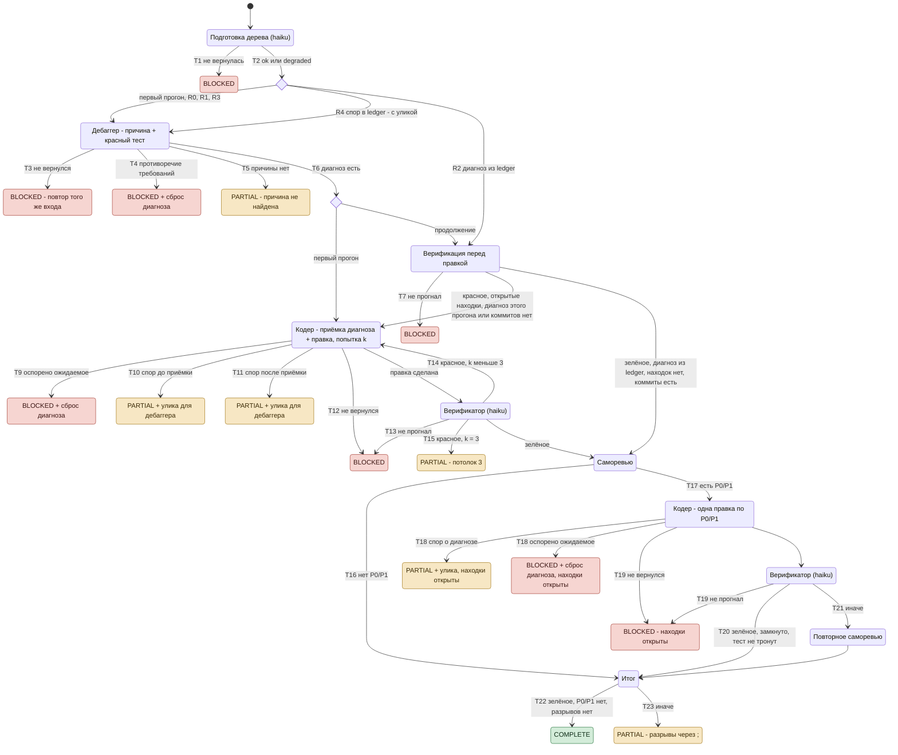

# Трек bugfix: спецификация

Эталон для кода `dex-auto/tracks/bugfix.js`, сценариев `tests/tracks/run.mjs` (префикс `B`) и ревью
трека. Код и сценарии сверяются с этим документом, не наоборот: переход без сценария - дыра покрытия,
ветка кода без перехода - дефект кода либо недописанная спецификация.

Статус документа: **черновик**, снят с кода рабочего дерева 24.09.2026; раздел 7 - открытые решения.

## Диаграмма состояний

Номера T/R - строки раздела 4. При расхождении с таблицами действуют таблицы.

## 1. Назначение и граница

Трек доводит один баг от симптома до локального коммита с независимой верификацией и саморевью.

- **Трек решает только по фактам:** `status` узла, значение перечня (`diagnosis-check`,
  `conflict-status`), exit code, хэш файла, счётчик, наличие поля. Что факт значит - решает узел.
- **Доменное суждение ведут узлы по своим нормам:** причину - дебаггер, приёмку диагноза - кодер по
  `node-contract`, `references/diagnosis-acceptance.md`, качество правки - саморевьюер.
- **Спор узлов трек не судит:** он останавливается и отдаёт спор оператору. Автоматического второго
  круга «кодер - дебаггер» внутри прогона нет.
- Вне трека: push, деплой, миграции данных, выбор стороны в противоречии требований.

## 2. Узлы

| Узел | Агент (замена при отказе - `general-purpose`) | Модель | Выход |
|---|---|---|---|
| подготовка дерева | `general-purpose` | haiku | стек, команды сборки/тестов/подготовки, `prepare-status` |
| дебаггер | `dex-debugger:debugger` | агента | причина `файл:строка`, красный тест (`repro_test`, снимок `repro_blob`), `conflict-status` |
| кодер | по стеку: `dex-ts-fullstack-coder:ts-fullstack-assistant` / `dex-dotnet-coder:dotnet-coder`, иначе `general-purpose` | агента | правка + локальный коммит, `diagnosis-check`, `dispute`, `prior` по находкам задания |
| верификатор | `general-purpose` | haiku | exit code, счётчики, `dirty`, `head`, `ahead` - коммитов текущей ветки дерева, которых нет на других ветках, `repro_test_hash` |
| саморевьюер | `dex-self-reviewer:self-reviewer` | агента | `findings` P0-P3, `intent-status`, `prior`, `review-verdict` (сигнал оператору, порогом не является) |

Узел, упавший ошибкой платформы, заменяется `general-purpose` с ролью в промпте; факт замены - строкой
`degraded`.

## 3. Вход и состояние между прогонами

**Вход** (`args`): `task, symptom, expected, env, done, boundary, mode, cwd, main_cwd, source, goal_path`;
при «продолжить» - `resume: true` и поля из auto-ledger: `trail` (пройденные шаги, передаются узлам),
`open_findings` (реестр находок, массив) и `repro`; оба - значением либо строкой JSON, как их печатает `ledger.py`.
`open_findings` не JSON-массив - строка `degraded`, записи ledger остаются открытыми, а прогон `complete` не отдаёт (разрыв).

**Решения трек принимает только по `repro`** (раздел «Контекст», последняя непустая строка по всем
прогонам), по наличию `trail` и непустому реестру `open_findings`. Журнал хранит все прогоны: улика каждого круга - в «Контексте» своего прогона, ответ
дебаггера - первой строкой `reproduction` следующего, причина остановки - строкой «Решений».

| Поле `repro` | Кто пишет | Смысл |
|---|---|---|
| `root_cause`, `files`, `reproduction`, `expected-basis`, `fix_proposal` | дебаггер | диагноз; `root_cause` пуст - диагноза нет; `reproduction` называет коммит диагноза (SHA), на нём кодер принимает диагноз |
| `repro_test`, `repro_blob` | дебаггер | путь теста и снимок `git hash-object -w` |
| `accepted` | трек, из первого не-`disputed-*` `diagnosis-check` кодера, кроме `n/a` при тесте в диагнозе | приёмка состоялась; новый диагноз сбрасывает |
| `accepted_blob` | трек, хэш верификации круга, на котором `harness-fixed` записан приёмкой и был первым исходом | ожидание гейта вместо `repro_blob` (I4); новый диагноз сбрасывает |
| `accepted_pending` | трек: `harness-fixed` первым исходом записан, прогнанной верификации его круга ещё не было; в записи ledger без поля - нет | снимок берёт верификация возобновления (I4); новый диагноз сбрасывает |
| `dispute` | трек, из `dispute` кодера при споре о диагнозе (T10, T11) | улика для следующего вызова дебаггера |
| `stack`, `build_cmd`, `test_cmd`, `prepare_cmd` | подготовка дерева этого прогона | техконтекст, из ledger не берётся |

**Форма сброса** `{ root_cause: '', files: [] }`: пустой «Контекст» прошлую запись ledger не перекрывает,
поэтому сброс диагноза пишется этой формой.

## 4. Переходы

Выход: `status` / `where` / что уходит в ledger полем `repro`. «-» - прогон продолжается.

### Context

| # | Условие | Действие | Выход |
|---|---|---|---|
| T1 | подготовка вернула `null` или `blocked` | стоп | `blocked` / Context / `repro` не пишется |
| T2 | `prepare-status: failed` либо подготовка `partial` | строка `degraded`; при `failed` дебаггеру и кодеру - команда подготовки | - |

### Вход возобновления

| # | `A.repro` | Действие |
|---|---|---|
| R0 | не подан, либо нет `trail` | дебаггер как в первом прогоне; нет `trail` - строка `decisions`, возобновление не применено |
| R1 | подан, но не форма (нет `root_cause` строкой или `files` массивом, строка не JSON) | строка `degraded`, дебаггер как в первом прогоне |
| R2 | форма, `root_cause` непуст, `dispute` пуст | диагноз из ledger, дебаггер не вызывается |
| R3 | форма, `root_cause` пуст, `dispute` пуст | дебаггер как в первом прогоне, без пометки |
| R4 | форма, `dispute` непуст | дебаггер с уликой и путём прежнего теста; прежний спор - первой строкой `disputes` |

Форма R2 - `root_cause` строкой и `files` массивом; прочие поля не требуются (`repro` до `conflict-status` без `conflicts` - тоже R2).
Дебаггер, вызванный на возобновлении (есть `trail`), получает поверх «не повторяй шаги» - «шаг 1 заново» с причиной.

### Reproduce

| # | Условие | Действие | Выход |
|---|---|---|---|
| T3 | дебаггер `null` / `blocked` | стоп, путь теста в `missing` | `blocked` / Reproduce / `repro` не пишется: прошлая запись ledger остаётся, «продолжить» повторяет тот же вход (R3 / R4) |
| T4 | `conflict-status: some` или непустой `conflicts` (проверяется до T5) | стоп, путь теста в `missing` | `blocked` / Reproduce / сброс |
| T5 | `root_cause` пуст | стоп, путь теста в `missing` | `partial` / «причина не установлена» / диагноз без причины + улика R4, если была |
| T6 | иначе | `repro` = диагноз + техконтекст, `accepted` и `dispute` пусты | - |

### Fix

Возобновление начинается с верификации (T7). Цикл правки идёт, пока дерево не зелёное, есть
незакрытые находки прошлого прогона, диагноз поставлен в этом прогоне либо коммитов трека нет (`ahead` 0);
потолок - 3 попытки.

| # | Условие | Действие | Выход |
|---|---|---|---|
| T7 | возобновление: верификатор не прогнал | стоп | `blocked` |
| T8 | попытка k: кодеру предписана приёмка (`accepted` пуст) либо сообщён её исход (`accepted` есть) со снимком приёмки; теста диагноста нет - «проба твоя»; находки ledger - с ответом по каждой в `prior` (closed либо disputed); исход прошлой верификации с числом прошедших - только красной | вызов кодера; правки оборвавшегося прошлого кодера в дереве распознаёт он сам по норме приёмки | - |
| T9 | `diagnosis-check: disputed-expected` | стоп, путь теста в `missing` | `blocked` / спор об ожидаемом / сброс |
| T10 | `disputed-test` / `disputed-cause`, `accepted` пуст | стоп | `partial` / «кодер оспорил диагноз» / `repro` + `dispute` |
| T11 | `disputed-test` / `disputed-cause`, `accepted` есть | стоп | как T10: `partial` / «кодер оспорил диагноз» / `repro` + `dispute` |
| T12 | кодер `null` / `blocked` | стоп | `blocked` / `repro` с `accepted` |
| T13 | верификатор не прогнал | стоп; `blocked` без `missing` - нехватка названа треком | `blocked` |
| T14 | дерево не зелёное, k < 3 | следующая попытка, прошлый `red-run` передаётся | - |
| T15 | дерево не зелёное, k = 3 | стоп | `partial` / потолок |

Зелёное дерево: `exit_code: 0`, `fail_count: 0`, `build_ok`, не `dirty`; при команде тестов `pass_count` больше 0.

### Review

| # | Условие | Действие | Выход |
|---|---|---|---|
| T16 | первое ревью, P0/P1 нет | к Final | - |
| T17 | первое ревью не `blocked`; открытые P0/P1 в реестре прогона ([ledger.md](../ledger.md), R9, R10) | одна правка по находкам (кодер, потолок 1); по каждой - `prior` closed либо disputed | - |
| T18 | правка по находкам: `disputed-*` | шаг правки - в `trail` и `decisions` | как T9 / T10, находки открыты, `prior` - статусы первого ревью |
| T19 | правка `null` / `blocked`; верификатор не прогнал | стоп | `blocked` / находки открыты |
| T20 | верификация зелёная, правка замкнута (`uncovered-status` и `dependents-status` - `none` с пустыми перечнями), хэш теста не изменился, каждую блокирующую кодер назвал `closed` | повторное ревью не вызывается; закрытые находки - поимённо в `decisions` | - |
| T21 | иначе | повторное ревью по всему открытому реестру прогона, некритичные первого тоже; его `null` / `blocked` статусов реестра не меняет, иначе поданная ему запись, о которой оно промолчало, - `unverified` «статус саморевью не сверен», его `prior` и `findings` входят в реестр по R10 (B121, B122, B126, B127) | - |

### Final

| # | Условие | Выход |
|---|---|---|
| T22 | зелёное дерево, ревью не `blocked`, открытых P0/P1 в реестре прогона нет, разрывов (ниже) нет | `complete` |
| T23 | иначе | `partial`, `where` - разрывы по порядку через `; ` |

Разрывы по порядку: реестр прежних находок не прочитан; кодер вернул `partial` либо `fact-check: contradicted`; тест удалён либо изменён против
ожидания (I4), либо правка прошла без записанной приёмки при тесте в диагнозе; воспроизведение `partial`;
внешнего факта нет - ни сборки, ни тестов; коммитов трека нет (`ahead` 0); саморевью `partial`; реализовано не то
(`intent-status: mismatch`).

## 5. Инварианты

- **I1.** Ветка трека читает только факт (раздел 1). Решение о значении факта - поле узла.
- **I2.** Дебаггер продуктовый код не меняет; его тест остаётся незакоммиченным до кодера.
- **I3.** Приёмка одна на диагноз: исход первой попытки фиксируется до верификации и переживает ledger;
  следующему исполнителю сообщается со снимком, не предписывается заново. Новый диагноз её сбрасывает.
  `n/a` при тесте в диагнозе приёмкой не записывается, но первым исходом остаётся.
- **I4.** Правка теста ловится хэшем против ожидания, а не отчётом кодера. Ожидание - `repro_blob`, после
  `harness-fixed` первым исходом - хэш верификации его круга (`accepted_blob`); круг оборвался до верификации
  (`accepted_pending`) - хэш верификации возобновления, первой после него и до новой попытки кодера (B120, B124, B125);
  поздний `harness-fixed` снимка не получает и на возобновлении (B123). Обвязку на круге приёмки судит ревью,
  сменивший хэш круг повторное ревью не пропускает. Удалённый тест (хэш - не шестнадцатеричная строка) - разрыв
  всегда, и без снимка; тест без снимка - строка `degraded`.
- **I5.** Дебаггер вызывается не больше одного раза за прогон.
- **I6.** Каждый не-`complete` выход несёт `where` и нехватку; путь оставленного в дереве теста назван.
- **I7.** Решение, отменяющее диагноз (противоречие, спор об ожидаемом), пишет в ledger форму сброса.
- **I8.** Находка закрывается только записью: `prior` ревью либо `closed` кодера на пути T20. Молчание
  узла о ней не закрывает; оспоренная кодером (`prior` disputed) - строка `decisions` с его основанием.

## 6. Что делает оператор на остановке

| Остановка | Что решает оператор | Что делает «продолжить» |
|---|---|---|
| T4, T9 - противоречие / спор об ожидаемом | чья сторона верна: правит источник требований или цель | дебаггер с нуля (R3) |
| T5 - причины нет | даёт недостающее (runtime, доступ) в цели | дебаггер с нуля (R3), а с уликой прошлого спора - с ней (R4) |
| T10 - спор до приёмки | ничего, либо поясняет в цели | дебаггер с уликой (R4); число кругов не ограничено - каждый начат командой оператора |
| T11, T18 - спор после приёмки | как T10 | дебаггер с уликой (R4); правки прошлых попыток в дереве он и следующий кодер распознают по своим нормам |
| T15 - потолок | - | верификация, затем цикл правки |

## 7. Открытые решения

Нет.
