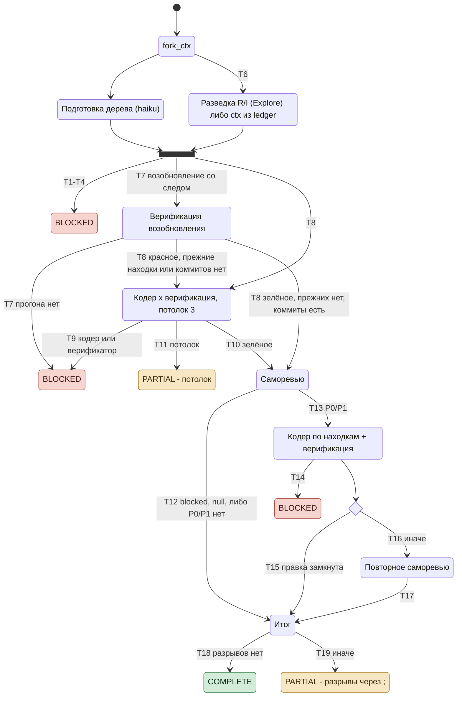

# Трек feature: спецификация

Эталон для кода `dex-auto/tracks/feature.js`, сценариев `tests/tracks/run.mjs` (префикс `F`) и ревью
трека. Код и сценарии сверяются с этим документом, не наоборот: переход без сценария - дыра покрытия,
ветка кода без перехода - дефект кода либо недописанная спецификация.

Статус документа: **эталон**, сверен с кодом и сценариями F1-F74 24.09.2026; цель трека - BR-AUTO-001
(`../brd.md`); открытых решений нет (раздел 7).

## Диаграмма состояний

Номера T - строки раздела 4. При расхождении с таблицами действуют таблицы.

## 1. Назначение и граница

Трек доводит цель разработки до локальных коммитов, подтверждённых внешним фактом - прогоном сборки и
тестов в дереве трека, - и саморевью без открытых P0/P1.

- **Дерево трека** - отдельное git worktree на ветке `auto/<TASK>`; каталог сессии - только чтение.
- **Push, деплой, миграции данных и удаление вне дерева не делает никто** - стоп-линия.
- **Трек решает только по фактам:** `status` узла, enum-поля выхода, числа верификатора, длина
  перечней. Что значит находка и закрыта ли она - решают узлы.
- **Порог допуска** - зелёная верификация, ноль P0/P1 в `findings` последнего ревью и среди `prior`
  открытых по реестру ([ledger.md](../ledger.md), R9), ни одного разрыва (T19). `review-verdict` - сигнал оператору, порогом не
  является.
- Вне трека: push, выбор стороны в противоречии источников требований, ответы автору.

## 2. Узлы

| Узел | Агент (замена при отказе - `general-purpose`) | Модель | Выход |
|---|---|---|---|
| подготовка дерева | `general-purpose` | haiku | стек по реестру с манифестом-основанием, команды сборки / тестов / подготовки, `prepare-status` done / not-needed / failed |
| разведка | `Explore` | сессии | R/I с источником, файлы, корпус, `conflict-status` с перечнем |
| кодер | по стеку: `dex-dotnet-coder:dotnet-coder`, `dex-ts-fullstack-coder:ts-fullstack-assistant`; стек вне реестра - `general-purpose` | агента | коммит, `red-run`, `uncovered-status`, `dependents-status`, `fact-check`, `decisions`, `prior` по находкам задания |
| верификатор | `general-purpose` | haiku | `exit_code`, `pass_count`, `fail_count`, `build_ok`, `dirty`, `ahead` - коммитов текущей ветки дерева, которых нет на других ветках (имя ветки из TASK не собирается - скрипт дерева его нормализует) |
| саморевьюер | `dex-self-reviewer:self-reviewer` | агента | `findings` P0-P3, `intent-status`, `prior`, `review-verdict` |

Узел каталога, упавший ошибкой платформы, заменяется `general-purpose` с ролью и причиной обрыва в
промпте; факт замены - строкой `degraded`. Стек вне реестра - кодер общего назначения без строки
`degraded`: замены не было, узла под стек в каталоге нет.

## 3. Вход и состояние между прогонами

**Вход** (`args`): `task, goal, done, boundary, mode, cwd, main_cwd, source, goal_path, resume, trail,
open_findings, ctx`.

- `resume` со `trail` - возобновление: `trail` - сделанные шаги, `ctx` - разведка прошлого прогона,
  `open_findings` - реестр ledger (`ledger.py findings TASK feature`); оба - объектом либо строкой JSON, как их печатает `ledger.py`.
- `resume` без `trail` - прогона по цели не было: трек идёт как первый, строка в `decisions`.
- `ctx` не в форме разведки (нет непустого `requirements` либо `files`, `conflicts` не перечнем) - разведка
  выводится узлом заново, подмена - строкой `degraded`; разведка прошлого прогона не `complete` - тоже заново,
  строкой `decisions`. `open_findings` не JSON-массив - строка `degraded`, записи ledger остаются открытыми, а
  прогон `complete` не отдаёт (разрыв).
- Подготовка дерева из ledger не берётся никогда: дерево - состояние, а не вывод.

`finish.sh` пишет возврат в реестр: `open_findings` - `open`, `prior` - свой статус по `id`; открытые
находки - разность реестра, находка без события прогона остаётся открытой.

## 4. Переходы

Выход: `status` / `where`. «-» - прогон продолжается.

### Context

Подготовка и разведка идут параллельно, барьер - перед шагом 2.

| # | Условие | Действие | Выход | Сценарии |
|---|---|---|---|---|
| T1 | подготовка `null` / `blocked` | стоп; `blocked` без `missing` - нехватка названа треком | `blocked` / `Context: подготовка дерева` | F31, F32, F61 |
| T2 | разведка `null` / `blocked` | стоп | `blocked` / `Context` | F4, F5 |
| T3 | разведка без единиц R/I | стоп | `blocked` / `Context` / «разведка не вывела ни одной единицы R/I» | F46 |
| T4 | `conflict-status: some` либо перечень `conflicts` непуст | стоп, `ctx: null` - разведка решение владельца не переживает | `blocked` / `Context` / противоречие с якорями сторон | F42, F43 |
| T5 | `prepare-status` done - кодеру «не повторять установку»; not-needed - строки нет; failed - кодер готовит дерево сам, строка `degraded`; `partial` подготовки - строка `degraded` | - | - | F26, F27, F30, F47 |
| T6 | `ctx` возобновления в форме разведки и `complete` - узел разведки не вызывается; источник требований есть - противоречие судит `requirement-quality`, нет - `conflict-status: none` | - | - | F11a, F11b, F35, F44, F66, F69, F70 |

### Implement

| # | Условие | Действие | Выход | Сценарии |
|---|---|---|---|---|
| T7 | возобновление со следом | сначала верификация; прогона нет | `blocked` / `Implement: верификация при возобновлении` | F10, F60 |
| T8 | цикл идёт, пока верификация не зелёная; прежние находки из ledger либо возобновление без коммитов трека (`ahead` 0) заводят первую попытку и на зелёном дереве | попытка k кодера: R/I, команды, прежние находки с ответом по каждой в `prior` (closed либо disputed), исход прошлой верификации с числом прошедших - только красной, `red-run` прошлой попытки фактом | - | F2, F10, F11, F28, F29, F64, F65, F68 |
| T9 | кодер `null` / `blocked`; верификатор `null` / `blocked` | стоп | `blocked` / `Implement#k` либо `Implement#k: верификация` | F6, F17, F62, F63 |
| T10 | зелёная: `exit_code` 0, `fail_count` 0, `build_ok`, дерево чистое, при команде тестов прошло больше нуля | к ревью | - | F1, F15, F49, F50 |
| T11 | потолок 3 исчерпан без зелёной | стоп | `partial` / `Implement: потолок 3 исчерпан`, решения всех попыток в выходе | F3, F19 |

### Review

| # | Условие | Действие | Выход | Сценарии |
|---|---|---|---|---|
| T12 | первое ревью: вход - R/I, `red-run`, `uncovered`, `dependents` кодера, прежние находки из ledger; ревью `null` / `blocked` - правка по находкам не заводится | к итогу | - | F14, F18, F21, F52, F55 |
| T13 | P0/P1 в `findings` либо среди прежних открытых | одна правка по всем с верификацией; кодер по каждой находке задания - `prior` closed либо disputed | - | F7, F36 |
| T14 | кодер `null` / `blocked`; верификатор `null` / `blocked` | стоп, находки ревью и `prior` в выходе | `blocked` / `Review: правка по находкам` либо `Review: верификация после правки` | F16, F59 |
| T15 | верификация зелёная, `uncovered-status` и `dependents-status` оба `none` с пустыми перечнями, каждую блокирующую кодер назвал `closed` | повторное ревью не покупается; блокирующие - `prior` closed с основанием и строкой `decisions` | - | F7a, F37, F71, F72 |
| T16 | иначе - в том числе `unknown`, противоречие статуса перечню, отказ или молчание кодера, красная верификация | повторное ревью: прежние открытые плюс блокирующие первого | - | F7b-F7g, F53, F54 |
| T17 | повторное `null` / `blocked` - блокирующие первого остаются открытыми; иначе его `prior` - статус; блокирующая первого, о которой оно промолчало, - `unverified` «статус саморевью не сверен»; названная снова в `findings` - только там | к итогу | - | F8, F22, F38, F39, F40, F73, F74 |

### Final

| # | Условие | Выход | Сценарии |
|---|---|---|---|
| T18 | верификация зелёная, ревью состоялось, P0/P1 нет ни в `findings`, ни среди открытых `prior`, разрывов нет | `complete` | F1, F9, F23, F39, F67 |
| T19 | иначе | `partial`; `where` - первое из: верификация не зелёная; ревью не вернуло выход; ревью `blocked`; открытые P0/P1; прежние P0/P1 не закрыты с `id`; разрывы через `; ` | F20, F41, F45, F48, F51, F56, F57, F58 |

Разрывы по порядку: реестр прежних находок не прочитан; разведка требований неполна (`partial`); внешнего факта нет - ни сборки, ни тестов;
коммитов трека нет (`ahead` 0); саморевью не завершено (`partial`); реализовано не то (`intent-status:
mismatch`); кодер вернул `partial`; `fact-check` кодера `contradicted`.

## 5. Инварианты

- **I1.** Ветка трека читает только факт (раздел 1). Решение о значении факта - поле узла.
- **I2.** `complete` - только при внешнем факте: команда сборки или тестов есть, прогон зелёный по
  числам раннера, на ветке трека есть свои коммиты.
- **I3.** Каждая петля ограничена потолком в скрипте: правка - 3, правка по находкам - 1, ревью - 2.
- **I4.** Находка закрывается только записью: `prior` ревью либо `closed` кодера на пути T15 с
  проверенной правкой. Молчание узла о находке и статус вне словаря реестра её не закрывают - она `unverified` с пометкой.
- **I5.** Выбор стороны в противоречии источников требований не делает ни один узел трека (T4).
- **I6.** Каждый не-`complete` выход несёт `where`; `blocked` - непустой `missing`.
- **I7.** Решения узлов копятся по всем попыткам, а не только по последней; оспоренная кодером прежняя находка (`prior` disputed) - решение с его основанием.

## 6. Что делает оператор на остановке

| Остановка | Что решает оператор | Что делает «продолжить» |
|---|---|---|
| T1-T3 - контекст не собран | доступ, узел, источник требований | разведка заново, дерево заново |
| T4 - противоречие источников | выбирает сторону и правит источник | разведка заново по исправленному источнику |
| T9, T14 - узел или прогон не отработал | причина по `missing` | верификация первой, затем правка с незакрытого |
| T11 - потолок | даёт недостающее либо сужает цель | верификация первой, новые три попытки |
| T19 - разрыв | по `where`: даёт недостающее, принимает риск строкой в `### Решения` либо закрывает цель `partial` | верификация, прежние находки из ledger идут кодеру и ревью |

## 7. Открытые решения

Нет.
