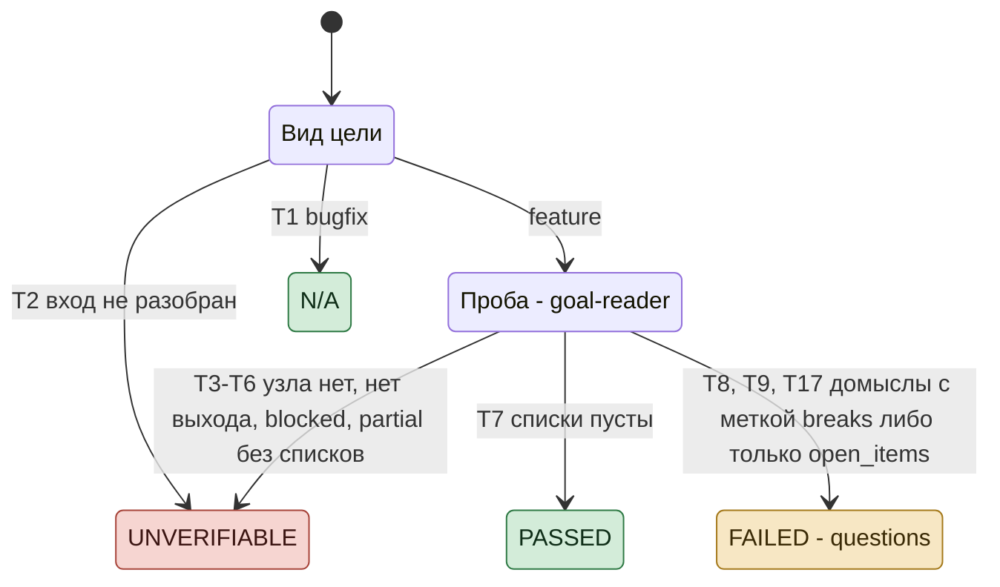
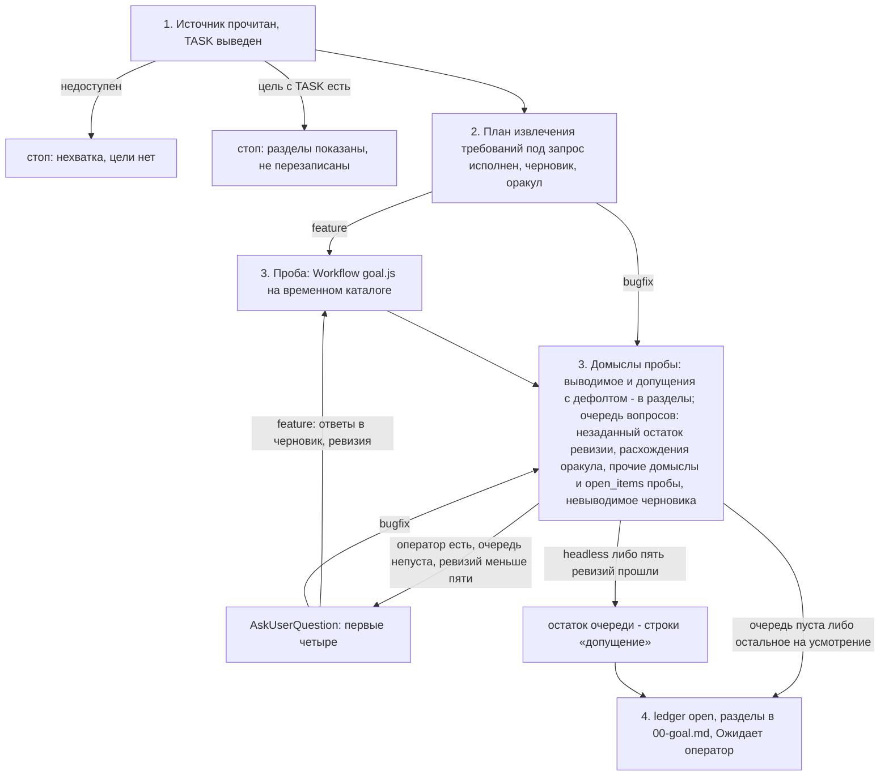

# Проба `/goal`: спецификация

Эталон для скрипта `dex-auto/tracks/goal.js`, сценариев `tests/tracks/run.mjs` (префикс `G`) и шагов
`commands/goal.md`, которые его вызывают. Скрипт - не трек: цель не доводит, ledger не пишет, дерева не
заводит. Код и сценарии сверяются с этим документом, не наоборот.

Статус документа: **эталон**, сверен с кодом и сценариями G1-G9, G15, G16, G18-G20, G22-G26 29.09.2026, шаги главного потока - с
живым прогоном P32 (`../notes/probes.md`); цель - BR-AUTO-001 (`../brd.md`, допущение «у цели есть
критерий «готово» в проверяемой форме»); открытое решение - раздел 8.

## Диаграмма состояний скрипта

Номера T - строки раздела 5. При расхождении с таблицами действуют таблицы.

## 1. Назначение и граница

Цель, по которой трек идёт без оператора, не оставляет треку решений об исходе, мере или границе:
каждое такое решение либо выведено из кода и корпуса проекта с якорем, либо принято оператором при
постановке. Проба находит их в черновике цели feature, главный поток делит на выводимые, допущения и
вопросы: вопросов - наименьшее число решений, после ответа на которые постановка цельна. Решения о способе
в выход не идут - их принимают узлы трека.

- **Скрипт решает только по фактам:** вид цели, исход вызова узла, `status`, длина
  списков, номера в `traces` и `kind` их строк. Что считать домыслом и расхождением и какого оно вида -
  решает узел; выводим ли домысел - главный поток (раздел 7).
- **Скрипт ничего не пишет** - ни ledger, ни код, ни диск. Корпус пробы - временный каталог, его
  заводит и удаляет главный поток; у узлов нет инструментов записи и команд (I6).
- **Только feature** - решение оператора 27.09.2026: у bugfix ожидаемое поведение задано прежним.
- **Согласованность с соседом выводима** - решение оператора 27.09.2026: домысел выводим, если то же
  решение уже принято в существующем поведении, контракте или соседнем месте кода и новое поведение,
  решённое иначе, разошлось бы с ним (P32: запись при отказе ФС бросает, как соседнее чтение). Прежнее
  поведение, которое источник просит изменить, ответом не служит; поэтому домысел с расхождением `breaks`
  (черновик допускает исход, который источник исключает, либо теряет требуемый) помечен (T17): из соседа
  такой выводился неверно (P57, 2 из 2).
- **Делит главный поток** - решение оператора 29.09.2026: узел-классификатор стоил около 40 тыс. токенов
  на ревизию и ошибался выводом из соседа (P51, P77), без него цель не хуже (P78).
- **План извлечения составляет главный поток** - решение оператора 30.09.2026: норма называет, кто получит
  цель и что он решит сам, способ извлечения требований и оси плана главный поток выбирает по входу, у оси - якорь входа.
- **Цена:** проба - узел на каждую цель feature независимо от размера правки (P31: около 100 тыс.
  токенов, 5 минут). Антиметрика продуктового BRD «число обязательных шагов»
  этим растёт; принято ради того, чтобы невыводимое решение пришло оператору при постановке, а не
  стоп-линией посреди трека.
- Вне скрипта: вопросы оператору, запись `00-goal.md`, судьба временного каталога - главный поток.

## 2. Алгоритм `/goal`

Нормативный текст шагов - `commands/goal.md`; здесь порядок и покрытие.

| Шаг | Покрытие |
|---|---|
| 1 - источник, существующая цель | существующая цель - P68 (её назвал сторож SessionStart); недоступный источник не покрыт |
| 2 - план извлечения, черновик, оракул | чтение кода и корпуса - P32; план под запрос - P81: без признака пункта план - порядок чтения; P82: с признаком - вопросы о запросе, правда оператора 10 из 10; P85: ось NFR в признаке - пункт безопасности, нагрузку план не берёт; P86: оси по входу с якорем - эталон 15 из 16, без перечня примеров |
| 3 - вызов пробы, ожидание возврата | P32 (прогон C), P68 (по имени); переходы скрипта - G1-G26 |
| 3 - деление домыслов: выводимое, допущение с дефолтом, вопрос | выводимое главным потоком - P78: 3 вывода, неверных 0; допущения с дефолтом - P79: по соседнему коду разошлись с оператором 3 из 7; P80: по конвенции либо практике - 0 из 10 |
| 3 - `Workflow` недоступен, завершился ошибкой, возврат не получен | P66: отказ запуска исполнитель обошёл (`script` текстом, копия скрипта в `.git/`), `unverifiable` не сдан в 2 из 2; P70: имя не зарегистрировано - `unverifiable` с причиной, обхода нет, 1 из 1 |
| 3 - очередь вопросов, headless-допущения | P32 (headless) |
| 3 - ревизии: ответы в черновик и источник корпуса, повторная проба, незаданный остаток очереди | командой - P66, P68: две ревизии, ответы дословно; P55, P56, P64, P65 вне команды: ответы вписаны в корпус пробы руками; остаток новая проба не подняла 0 из 3 (P64); шум у строки ответа из одних слов оператора 0, с добавками черновика 3 (P65, P64) |
| 3 - потолок пять ревизий, остаток допущениями | не покрыт командой; P54-P56, P64: очередь после третьей ревизии непуста в 3 из 3; P65: ответ оператора сверх «на усмотрение» в остатке - 1 из 12 |
| 4 - запись цели | P32; путь `ledger.py` от корня плагина - P69 |

## 3. Вход и состояние

**Вход** (`args`): `kind, corpus, cwd`.

- `kind` - вид из черновика (`feature` | `bugfix`).
- `corpus` - временный каталог: `goal.md` - черновик трёх разделов без машинных строк, `source.md` -
  текст источника (для формулировки - она сама) и раздел `## Ответы оператора` с ответами прошлых ревизий:
  ответ - тоже источник, и трасса сверяет черновик с источником вместе с ответами (P55-P62).
- `cwd` - корень проекта, только на чтение: код, в который встанет правка.

Состояния между вызовами нет: скрипт судит черновик, какой он есть. Ревизии ведёт шаг 3 `/goal`: черновик с
ответами оператора - новый вызов.

## 4. Узлы

| Узел | Агент | Модель и effort | Выход |
|---|---|---|---|
| проба | `dex-auto:goal-reader`, **без замены** | `sonnet`, effort сессии | `status`, `plan`, `promises`, `trace` - `{where, delivery, diff, kind}` на предложение источника, `kind` - `breaks` \| `refines`, `gaps` - `{where, gap}`, `guesses` - `{where, decision, cost, covers, traces}`, `covers` - номера пробелов с 1, `traces` - номера строк `trace` с 1, `open_items`, `missing`; `plan`, `promises`, `trace` и `gaps` стоят до `guesses`: узел выписывает домысел по уже выписанным развилкам, расхождениям и пробелам (G5) |

Узел едет в `dex-auto` со скриптом: контракт узла - его файл, цель и выдача по
полям; схема в скрипте держит форму выдачи - поля, порядок, типы - без описаний (G6). Модель и effort задаёт
скрипт по таблице `tracks-shared/nodes.js`, frontmatter узла их не несёт (G5, G6); `sonnet` у пробы - модель
пробы в прогонах P76-P86. Узел пробы на
`general-purpose` не заменяется: замена не несёт определения домысла, и её список пришёл бы оператору
вопросами без фильтра. Практика стека, как и
код проекта, домысла не снимает.

## 5. Переходы

Выход скрипта: `{probe, reason, questions, open_items, degraded}`; `probe` - `n/a` | `unverifiable` |
`passed` | `failed`; домысел в `questions` - `{id, where, decision, cost, gaps, breaks}`, `gaps` - тексты
пробелов и расхождений трассы, которые снимает ответ. Расхождение трассы - строка `trace` с непустым `diff`; `diff` из «нет» либо «-» с пробелами вокруг - пустой. В колонке «Выход» таблиц ниже «-» - прогон продолжается.

### Вход

| # | Условие | Действие | Выход | Сценарии |
|---|---|---|---|---|
| T1 | `kind: bugfix` | узлы не вызываются | `n/a`, `reason` «вид bugfix: проба только для feature» | G1 |
| T2 | `kind` ни `feature`, ни `bugfix`, `args` не объект либо у feature `corpus` или `cwd` пусто или не строка | узлы не вызываются | `unverifiable`, `reason` «вход пробы не разобран: ...» с видом, формой `args` либо такими полями | G16 |

### Probe

| # | Условие | Действие | Выход | Сценарии |
|---|---|---|---|---|
| T3 | узел пробы упал ошибкой платформы | замены нет | `unverifiable`, `reason` «узел пробы <агент> не отработал: <ошибка>» | G2 |
| T4 | узел вернул `null` | - | `unverifiable`, «узел пробы не вернул выход» | G3 |
| T5 | `status: blocked` | - | `unverifiable`, `missing` узла либо «узел пробы вернул blocked без нехватки» | G4 |
| T6 | `guesses`, `gaps` и `open_items` пусты, расхождений трассы нет, `status: partial` | - | `unverifiable`, «проба partial без домыслов: <missing>» | G15 |
| T7 | `guesses`, `gaps` и `open_items` пусты, расхождений трассы нет, иначе | - | `passed` | G7 |
| T8 | иначе | домыслы с расхождением `breaks` (условие T17) идут первыми, в каждой группе - по убыванию суммы покрытых пробелов и расхождений трассы, при равенстве - домыслы пробы в её порядке, затем из расхождений (T15), затем из пробелов (T12), и получают `id` D1..Dn по этому порядку; `status: partial` - строка `degraded` с `missing`; `open_items` - в выход | - | G8, G9, G20, G24, G26 |
| T12 | пробел, номера которого нет в `covers` ни одного домысла | домысел из пробела: `where` и `decision` - пробел, `cost` пуст; строка `degraded` «пробелы <номера> не покрыты домыслом пробы - вопросом как есть» | - | G18 |
| T13 | номер в `covers` вне `gaps` | номер снят; строка `degraded` «домыслы ссылаются на пробелы вне списка: <номера> - сняты» | - | G19 |
| T15 | расхождение трассы, номера которого нет в `traces` ни одного домысла | домысел из строки: `where` - её `where`, `decision` - `diff`, `cost` пуст; строка `degraded` «расхождения трассы <номера> не покрыты домыслом пробы - вопросом как есть» | - | G22 |
| T16 | номер в `traces` вне `trace` либо на строку без расхождения | номер снят; строка `degraded` «домыслы ссылаются на строки трассы без расхождения: <номера> - сняты» | - | G23 |
| T9 | после T8, T12 и T15 домыслов нет | - | `failed`, `questions` пуст | G9 |
| T17 | иначе | каждый домысел - в `questions` в порядке `id`, `breaks: true`, если после T16 в его `traces` есть строка с `kind` не `refines`, иначе `false` | `failed` | G25 |

## 6. Инварианты

- **I1.** Каждый домысел пробы в выходе ровно один раз - в `questions`.
- **I2.** Скрипт выводимость не судит: деление домыслов - главный поток (раздел 7).
- **I3.** Узел пробы не подменяется: при `unverifiable` пустой `questions` не значит «вопросов нет»,
  и `reason` это называет.
- **I4.** `reason` непуст при `n/a` и `unverifiable`.
- **I5.** Узел пробы вызывается не больше одного раза за вызов скрипта; петель нет.
- **I6.** Скрипт не пишет на диск и в ledger; инструменты узлов - Read, Grep, Glob, Skill, без записи и команд
  (G6).
- **I7.** Каждый пробел и каждое расхождение трассы снимает хотя бы один домысел выхода: не покрытое узлом
  идёт своим вопросом (G18, G22).

## 7. Что делает главный поток с исходом

| `probe` | Действие `/goal` |
|---|---|
| `n/a`, `passed` | пакет вопросов - по своему черновику |
| `failed` | каждый домысел `questions` - по правилу шага 3 `commands/goal.md`: выводимый - строкой с ответом и якорем `файл:строка` в проекте либо источнике; невыводимый с дефолтом - строкой «допущение»; прочие в порядке выхода, каждый с `gaps`, и `open_items` - в очередь вопросов |
| `unverifiable` | `reason` в Output; пакет вопросов - по своему черновику |

Строки `degraded` идут в Output `/goal`.

## 8. Открытые решения

- **Вид при неясном источнике.** `commands/goal.md`, раздел «Вход»: «неясно - `bugfix` с пометкой
  «допущение»». Неясный источник новой функции уходит в bugfix, и проба по нему не идёт.
