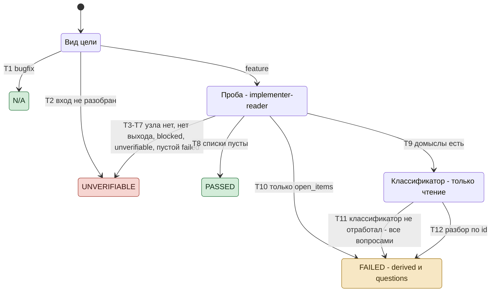
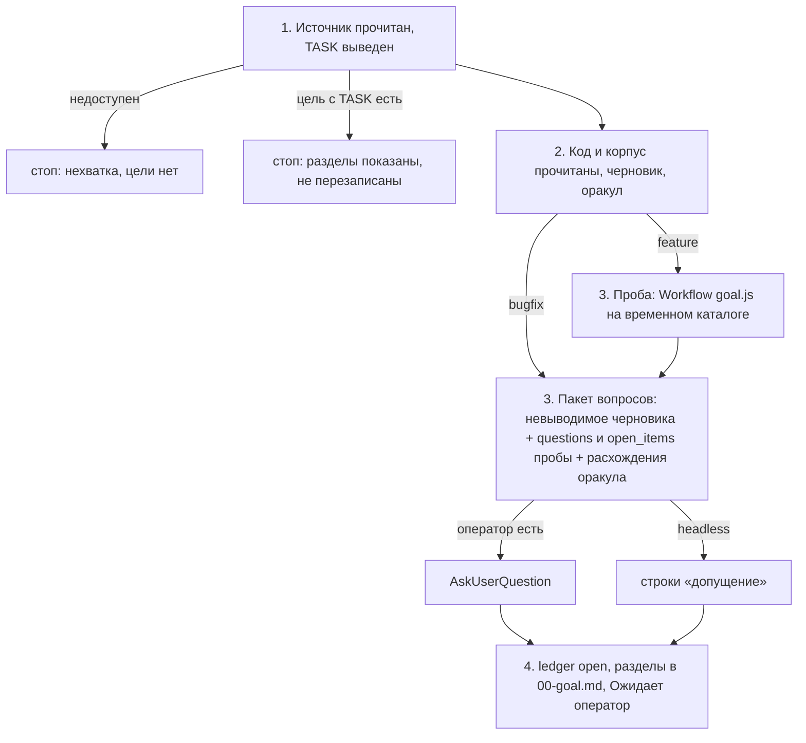

# Проба `/goal`: спецификация

Эталон для скрипта `dex-auto/tracks/goal.js`, сценариев `tests/tracks/run.mjs` (префикс `G`) и шагов
`commands/goal.md`, которые его вызывают. Скрипт - не трек: цель не доводит, ledger не пишет, дерева не
заводит. Код и сценарии сверяются с этим документом, не наоборот.

Статус документа: **эталон**, сверен с кодом и сценариями G1-G18 27.09.2026, шаги главного потока - с
живым прогоном P32 (`../notes/probes.md`); цель - BR-AUTO-001 (`../brd.md`, допущение «у цели есть
критерий «готово» в проверяемой форме»); открытое решение - раздел 8.

## Диаграмма состояний скрипта

Номера T - строки раздела 5. При расхождении с таблицами действуют таблицы.

## 1. Назначение и граница

Цель, по которой трек идёт без оператора, не оставляет треку решений об исходе, мере или границе:
каждое такое решение либо выведено из кода и корпуса проекта с якорем, либо принято оператором при
постановке. Проба находит их в черновике цели feature и делит на выводимые и вопросы; решения о
способе в выход не идут - их принимают узлы трека.

- **Скрипт решает только по фактам:** вид цели, исход вызова узла, `status` и `verdict`, длина
  списков, форма якоря, совпадение `id`. Что считать домыслом и выводим ли он - решают узлы.
- **Скрипт ничего не пишет** - ни ledger, ни код, ни диск. Корпус пробы - временный каталог, его
  заводит и удаляет главный поток; узлу пробы запись запрещена промптом, классификатор только читает.
- **Только feature** - решение оператора 27.09.2026: у bugfix ожидаемое поведение задано прежним.
- **Согласованность с соседом выводима** - решение оператора 27.09.2026: домысел `derived`, если то же
  решение уже принято в существующем поведении, контракте или соседнем месте кода и новое поведение,
  решённое иначе, разошлось бы с ним (P32: запись при отказе ФС бросает, как соседнее чтение). Прежнее
  поведение, которое источник просит изменить, ответом не служит.
- **Цена:** проба - два узла на каждую цель feature независимо от размера правки (P31: один узел
  пробы - около 100 тыс. токенов, 5 минут). Антиметрика продуктового BRD «число обязательных шагов»
  этим растёт; принято ради того, чтобы невыводимое решение пришло оператору при постановке, а не
  стоп-линией посреди трека.
- Вне скрипта: вопросы оператору, запись `00-goal.md`, судьба временного каталога - главный поток.

## 2. Алгоритм `/goal`

Нормативный текст шагов - `commands/goal.md`; здесь порядок и покрытие.

| Шаг | Покрытие |
|---|---|
| 1 - источник, существующая цель | не покрыт: ветки остановки живым прогоном не проходились |
| 2 - чтение, черновик, оракул | P32 |
| 3 - вызов пробы, ожидание возврата | P32 (прогон C); переходы скрипта - G1-G18 |
| 3 - слияние `derived` в разделы | не покрыт: в прогоне C `derived` не было, A и B шли по редакции без правила места |
| 3 - `Workflow` недоступен, завершился ошибкой, возврат не получен | не покрыт |
| 3 - пакет вопросов, headless-допущения | P32 (headless) |
| 4 - запись цели | P32 |

## 3. Вход и состояние

**Вход** (`args`): `kind, corpus, cwd`.

- `kind` - вид из черновика (`feature` | `bugfix`).
- `corpus` - временный каталог: `goal.md` - черновик трёх разделов без машинных строк, `source.md` -
  текст источника (для формулировки - она сама).
- `cwd` - корень проекта, только на чтение: там классификатор ищет ответ и якорь, узел пробы -
  контракт интерфейса.

Состояния между прогонами нет: каждый `/goal` - новая проба, ревизия 1.

## 4. Узлы

| Узел | Агент | Модель | Выход |
|---|---|---|---|
| проба | `dex-implementer-reader:implementer-reader`, **без замены** | агента | `status`, `verdict`, `guesses` - `{where, decision, cost}`, `open_items`, `missing` |
| классификатор | `general-purpose`, только чтение | сессии | `status`, `items` - `{id, class: derived \| question, answer, anchor}`, `missing` |

Узел пробы на `general-purpose` не заменяется: замена не несёт определения домысла и чистого
контекста, и её список пришёл бы оператору вопросами без фильтра. Отказ узла - исход `unverifiable`.

## 5. Переходы

Выход скрипта: `{probe, reason, derived, questions, open_items, degraded}`; `probe` - `n/a` |
`unverifiable` | `passed` | `failed`. «-» - прогон продолжается.

### Вход

| # | Условие | Действие | Выход | Сценарии |
|---|---|---|---|---|
| T1 | `kind: bugfix` | узлы не вызываются | `n/a`, `reason` «вид bugfix: проба только для feature» | G1 |
| T2 | `kind` ни `feature`, ни `bugfix`, `args` не объект либо у feature `corpus` или `cwd` пусто или не строка | узлы не вызываются | `unverifiable`, `reason` «вход пробы не разобран: ...» с видом, формой `args` либо такими полями | G16 |

### Probe

| # | Условие | Действие | Выход | Сценарии |
|---|---|---|---|---|
| T3 | узел пробы упал ошибкой платформы | замены нет | `unverifiable`, `reason` «узел пробы <агент> не отработал: <ошибка>» | G2 |
| T4 | узел вернул `null` | - | `unverifiable`, «узел пробы не вернул выход» | G3 |
| T5 | `status: blocked` | - | `unverifiable`, `missing` узла либо «узел пробы вернул blocked без нехватки» | G4 |
| T6 | `verdict: unverifiable` | - | `unverifiable`, `missing` узла либо «узел пробы вынес unverifiable без причины» | G5 |
| T7 | `guesses` и `open_items` пусты, а `verdict: failed` либо `status: partial` | - | `unverifiable`, «узел пробы вынес failed без домыслов и открытых пунктов» либо «проба partial без домыслов: <missing>» | G6, G15 |
| T8 | `guesses` и `open_items` пусты, иначе | классификатор не вызывается | `passed` | G7 |
| T9 | списки непусты | домыслы получают `id` D1..Dn по порядку списка; `verdict: passed` - строка `degraded`, судит список; `status: partial` - строка `degraded` с `missing`; `open_items` - в выход | - | G8, G9, G11 |
| T10 | после T9 `guesses` пуст | классификатор не вызывается | `failed`, `derived` и `questions` пусты | G9 |

### Sort

| # | Условие | Действие | Выход | Сценарии |
|---|---|---|---|---|
| T11 | классификатор упал, вернул `null` либо `blocked` | все домыслы - в `questions`; строка `degraded` «классификатор <не отработал (ошибка) \| не вернул выход \| blocked: missing> - все домыслы вопросами» | `failed` | G10 |
| T12 | иначе | по `id` берётся первая запись; `derived` с непустым `answer` и `файл:строка` в `anchor` (строка, диапазон `a-b` либо перечень `a,b`) - в `derived` с этим якорем без текста вокруг; прочие - в `questions`; `id` без записи - в `questions` и строка `degraded`; чужой `id` и повтор `id` - строка `degraded`; `status: partial` - строка `degraded` с `missing` | `failed` | G11-G14, G17 |

## 6. Инварианты

- **I1.** Каждый домысел пробы в выходе ровно в одном списке - `derived` либо `questions`.
- **I2.** В `derived` домысел идёт только с `answer` и якорем `файл:строка` без текста вокруг; иначе он
  вопрос: невыводимое не уходит в цель без адреса, по которому оператор его проверит.
- **I3.** Узел пробы не подменяется: при `unverifiable` пустой `questions` не значит «вопросов нет»,
  и `reason` это называет.
- **I4.** `reason` непуст при `n/a` и `unverifiable`.
- **I5.** Каждый узел вызывается не больше одного раза; петель нет.
- **I6.** Скрипт не пишет на диск и в ledger; узлы читают через Read, Grep, Glob, без `Bash`: при открытой
  цели с деревом сторож отбивает узлу, запущенному в дереве сессии, любую команду и правку (G18).

## 7. Что делает главный поток с исходом

| `probe` | Действие `/goal` |
|---|---|
| `n/a`, `passed` | пакет вопросов - по своему черновику |
| `failed` | `derived` - строкой с `answer` и якорем: об исходе или мере - в критерий «готово», о границе - в границу, не в `## Решения`; `questions` и `open_items` - в пакет вопросов шага 3 |
| `unverifiable` | `reason` в Output; пакет вопросов - по своему черновику |

Строки `degraded` идут в Output `/goal`.

## 8. Открытые решения

- **Вид при неясном источнике.** `commands/goal.md`, раздел «Вход»: «неясно - `bugfix` с пометкой
  «допущение»». Неясный источник новой функции уходит в bugfix, и проба по нему не идёт.
