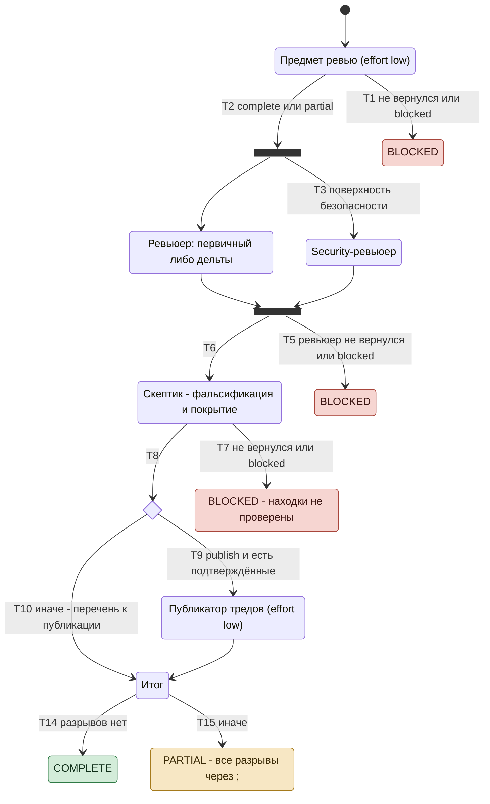

# Трек review: спецификация

Эталон для кода `dex-auto/tracks/review.js`, сценариев `tests/tracks/run.mjs` (префикс `R`) и ревью
трека. Код и сценарии сверяются с этим документом, не наоборот: переход без сценария - дыра покрытия,
ветка кода без перехода - дефект кода либо недописанная спецификация.

Статус документа: **эталон**, сверен с кодом и сценариями R1-R53 24.09.2026; цель трека - BR-AUTO-003
(`../brd.md`); открытых решений нет (раздел 7).

## Диаграмма состояний

Номера T - строки раздела 4. При расхождении с таблицами действуют таблицы.

## 1. Назначение и граница

Трек выносит ревью чужого MR/PR: находки проверены скептиком, по покрытию вынесен вердикт, треды
опубликованы только по санкции оператора.

- **Read-only:** код, ветки и коммиты не меняются; дерево трека - detached worktree, его ревизии
  переключаются свободно.
- **Трек решает только по фактам:** `status` узла, флаг `security_surface`, наличие санкции
  `publish`, длина перечня. Что находка значит и выдержала ли она проверку - решают узлы.
- **Запись в MR - только узел публикации и только при `publish=true`** (флаг `--post` команды).
  Approve и request changes не ставит никто: `review-verdict` уходит оператору в выход.
- **Итоговый `review-verdict` выносит скептик** по подтверждённым находкам, включая находки security;
  вердикт ревьюера идёт рядом полем `reviewer_verdict` и итогом не является.
- Вне трека: правка кода, ответы автору в тредах, чужие треды.

## 2. Узлы

| Узел | Агент (замена при отказе - `general-purpose`) | Модель / effort | Выход |
|---|---|---|---|
| предмет ревью | `general-purpose` | сессии / low | платформа, `base_sha`, `head_sha`, файлы, `security_surface` с основанием, `intent` |
| ревьюер | `dex-mr-reviewer:mr-reviewer`; при `last_review_sha` - `dex-mr-check-reviewer:mr-check-reviewer` | агента | находки P0-P3 по осям с уликой, исход каждой оси, `review-verdict`, `prior` - запись `{id, anchor, severity, text, status, evidence}` на каждую находку перечня ledger, `threads` - находки тредов MR вне перечня той же формы без `id`, `questions` |
| security-ревьюер | `dex-security-reviewer:security-reviewer`, только при `security_surface` | агента | находки оси security, исход оси, `threat_model`; своего вердикта в трек не отдаёт |
| скептик | `general-purpose` | сессии | `confirmed`, `dropped` с причиной, `coverage`, `review-verdict`, `prior` той же формы со сверенным статусом; `status` - словарь ре-ревьюера: closed, partial, open, disputed, no-longer-applicable |
| публикатор | `general-purpose` | сессии / low | `published` с `axis`, url и `note`, `unpublished` с `axis` и причиной |

Узел, упавший ошибкой платформы, заменяется `general-purpose` с ролью в промпте; факт замены - строкой
`degraded`. Ревьюер и security-ревьюер идут параллельно.

## 3. Вход и состояние между прогонами

**Вход** (`args`): `task, mr, intent, mode, publish, last_review_sha, cwd, open_findings`.

- `open_findings` - реестр ledger (`ledger.py findings`): открытые, `partial` и непроверенные находки прошлых прогонов с `id`,
  массивом либо строкой JSON, при каждом прогоне. Прежние находки - эти записи плюс `threads` ревьюера, опознанные и
  пронумерованные по R10 [ledger.md](../ledger.md) (R51). Поле не JSON-массив - строка в `degraded`, прогон идёт,
  записи ledger остаются открытыми, `complete` не отдаётся (R49).

- `last_review_sha` задан - ревизия дельты (трек ledger `review-delta`, реестр общий с `review`): ревьюер дельты, новые
  находки только в дельте. Статус прежней находки у ревьюера - claim: скептик сверяет каждую с кодом `head_sha`, в выход
  `prior` идёт сверенный статус с уликой и `id`; `disputed` - только когда код опровергает находку; «закрыта» не
  подтвердилась - `open` или `partial`, и находка участвует в вердикте. `prior` и `confirmed` скептика входят в реестр
  по R10 (R52, R53).
- `publish` - санкция на инлайн-треды; без неё подтверждённые находки уходят перечнем к публикации.
- `intent` не передан - узел предмета берёт описание MR и тикет, не нашёл - `n/a` с перечнем, где искал.

**Возобновления нет:** «продолжить» перезапускает трек с теми же `args`, `trail` и `ctx` из ledger не
подаются. Повтор публикации держит публикатор (T9): треды прошлого прогона он находит в MR сам. `finish.sh`
пишет возврат в реестр: `confirmed` - `open`, `claims` - `unverified`, `prior` - свой статус по `id`, `dropped`;
открытые находки - разность реестра, находка без события прогона остаётся открытой.

## 4. Переходы

Выход: `status` / `where`. «-» - прогон продолжается.

### Context

| # | Условие | Действие | Выход |
|---|---|---|---|
| T1 | узел предмета вернул `null` или `blocked` | стоп | `blocked` / `Context` / `missing` узла, «узел вернул blocked без нехватки» либо «узел контекста не вернул выход» |
| T2 | иначе | ревизия, файлы и основание поверхности идут в промпты узлов ревью; `partial` предмета - разрыв «предмет ревью неполон» | - |

### Review

| # | Условие | Действие | Выход |
|---|---|---|---|
| T3 | `security_surface: true` | security-ревьюер параллельно ревьюеру; ревьюеру ось security запрещена | - |
| T4 | `security_surface: false` | security-ревьюер не вызывается; ревьюеру и в выход ось `n/a - <основание>` | - |
| T5 | ревьюер `null` / `blocked` | стоп; находки security-ревьюера - полем `claims` непроверенными, `security` - в форме финала | `blocked` / `Review` / `missing` узла, «узел вернул blocked без нехватки» либо «узел ревью не вернул выход» |
| T6 | иначе | claims = claims ревьюера + claims security-ревьюера, если он вернул выход; скептику каждая идёт с уликой ревьюера. Разрывы: `partial` ревьюера - «ревью не завершено»; при объявленной поверхности security-ревьюер `null` / `blocked` - «ось security не проверена», `partial` - «ось security проверена не полностью» | - |

### Falsify

| # | Условие | Действие | Выход |
|---|---|---|---|
| T7 | скептик `null` / `blocked` | стоп; claims уходят в выход непроверенными, прежние находки - `prior` со статусом `unverified`, `security` - в форме финала | `blocked` / `Falsify` / `missing` узла, «скептик вернул blocked без нехватки» либо «скептик не вернул выход - находки не проверены» |
| T8 | иначе | `confirmed` / `dropped`; непокрытая ветка изменённого поведения - находка оси `coverage` в `confirmed`; claims пусты - скептик судит только покрытие; по каждой прежней - сверенный `prior`, прежняя без записи скептика - `unverified` и разрыв «статус прежних находок не сверен скептиком»; итоговый `review-verdict` - по правилу поля `review-verdict` node-contract (скептик вызывает `Skill`), в счёт идут `confirmed` и `prior` со статусом `open` / `partial`; `APPROVE` при P0/P1 среди них - разрыв; `partial` скептика - разрыв | - |

### Publish

| # | Условие | Действие | Выход |
|---|---|---|---|
| T9 | `publish` и `confirmed` непуст | публикатор сначала читает треды MR своего аккаунта: тред по находке на том же anchor уже есть - не публикует, в `published` с его url и `note` «уже был»; иначе тред с severity и критерием закрытия; отказ канала - в `unpublished` с причиной | - |
| T10 | санкции нет | `unpublished` = все `confirmed` с причиной «санкции publish нет - перечень к публикации» | - |
| T11 | `publish`, `confirmed` пуст | публикатор не вызывается | - |
| T12 | публикатор `null` | `unpublished` = все `confirmed` с причиной «узел публикации не вернул выход - находки к публикации»; разрыв | - |
| T13 | публикатор вернул выход, но по части `confirmed` не назвал исхода - сверка по `anchor` и `axis` (например `blocked` с пустыми перечнями) | каждая такая находка дописывается в `unpublished` с причиной «публикатор (<status>): исход по находке не назван»; разрыв | - |

### Final

| # | Условие | Выход |
|---|---|---|
| T14 | разрывов нет | `complete` |
| T15 | иначе | `partial`, `where` и `missing` - все разрывы через `; ` |

Разрывы по порядку: реестр прежних находок не прочитан; предмет ревью неполон; ревью не завершено; ось security не проверена либо проверена не полностью;
фальсификация не `complete`; статус прежних находок не сверен скептиком; часть тредов не опубликована (публикатор `null`, не `complete` либо
`unpublished` непуст); `review-verdict: APPROVE` при открытых P0/P1.

## 5. Инварианты

- **I1.** Ветка трека читает только факт (раздел 1). Решение о значении факта - поле узла.
- **I2.** Ни один узел не меняет код, ветки и коммиты; запись в MR - только публикатор при `publish=true`.
- **I3.** Находка попадает в выход как подтверждённая только через скептика; на остановке T7 claims
  возвращаются отдельным полем и подтверждёнными не называются.
- **I4.** Объявленная поверхность безопасности без полностью отработавшего security-ревьюера -
  непроверенная ось, а не чистая: трек не отдаёт `complete`. То же для `partial` ревьюера и предмета
  ревью.
- **I5.** Каждая подтверждённая находка в выходе либо опубликована (`published` с url), либо названа в
  `unpublished` с причиной - и тогда, когда публикатор о ней промолчал; находка опознаётся парой
  `anchor` и `axis`, при оси, пустой у одной стороны, - по `anchor`.
- **I6.** Каждый узел вызывается не больше одного раза за прогон; петель нет.
- **I7.** Каждый не-`complete` выход несёт `where` и непустой `missing`; узел, не назвавший нехватку,
  получает подстановку, а не пустую строку.
- **I8.** Итоговый `review-verdict` и `prior` дельты - выход скептика, не ревьюера: в выход не попадает
  суждение, не прошедшее фальсификацию. Прежняя находка со статусом `open` или `partial` весит в вердикте наравне
  с подтверждённой; прежняя, о которой скептик промолчал, - `unverified`, не закрыта и не открыта молча.
- **I9.** Ось security судит только security-ревьюер: при объявленной поверхности ревьюеру она
  запрещена, без поверхности - названа `n/a` с основанием.

## 6. Что делает оператор на остановке

| Остановка | Что решает оператор | Что делает «продолжить» |
|---|---|---|
| T1 - предмет недоступен | доступ к MR, ревизии, каналу хостинга | трек с нуля |
| T5 - ревьюер не отработал | причина по `missing`; узел не установлен - ставит | трек с нуля |
| T7 - находки не проверены | ничего либо даёт недостающее скептику | трек с нуля; claims и прежние прошлого прогона приходят из ledger `unverified` и идут скептику прежними |
| T15 - треды не опубликованы | публикует сам по перечню либо перезапускает с `--post` | трек с нуля; опубликованные треды публикатор находит в MR и не дублирует |
| T15 - ревью или ось security не завершены | по `missing` даёт недостающее, ставит узел либо принимает риск строкой в `### Решения` | трек с нуля |

## 7. Открытые решения

Нет.
