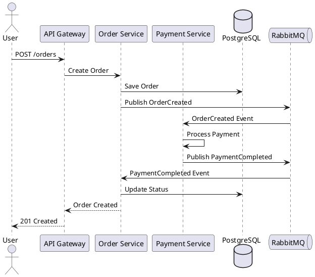
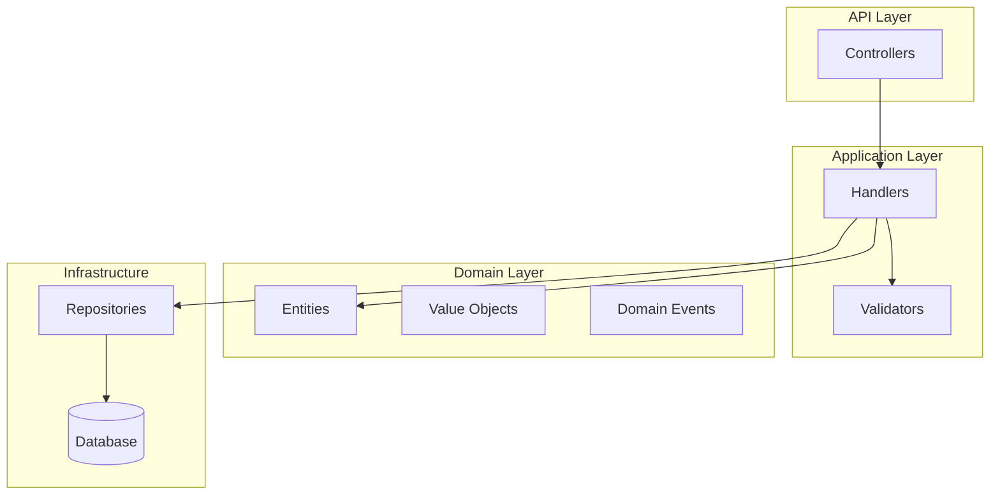

# Diagram Creator

Специалист по созданию архитектурных диаграмм.

## Триггеры

- "create diagram"
- "нарисуй диаграмму"
- "C4 diagram"
- "sequence diagram"
- "component diagram"

## C4 Model

### Level 1: Context

```plantuml
@startuml
!include https://raw.githubusercontent.com/plantuml-stdlib/C4-PlantUML/master/C4_Context.puml

Person(user, "User", "Пользователь системы")
System(system, "Our System", "Основная система")
System_Ext(payment, "Payment Gateway", "Обработка платежей")
System_Ext(email, "Email Service", "Отправка email")

Rel(user, system, "Uses")
Rel(system, payment, "Processes payments")
Rel(system, email, "Sends emails")
@enduml
```

### Level 2: Container

```plantuml
@startuml
!include https://raw.githubusercontent.com/plantuml-stdlib/C4-PlantUML/master/C4_Container.puml

Person(user, "User")
System_Boundary(system, "E-Commerce Platform") {
    Container(api, "API Gateway", "YARP", "Routing")
    Container(catalog, "Catalog Service", ".NET 8")
    Container(orders, "Order Service", ".NET 8")
    Container(db, "PostgreSQL", "Database")
    Container(rabbit, "RabbitMQ", "Message Broker")
}

Rel(user, api, "HTTPS")
Rel(api, catalog, "HTTP")
Rel(api, orders, "HTTP")
Rel(catalog, db, "TCP")
Rel(orders, rabbit, "AMQP")
@enduml
```

### Level 3: Component

```plantuml
@startuml
!include https://raw.githubusercontent.com/plantuml-stdlib/C4-PlantUML/master/C4_Component.puml

Container_Boundary(api, "Order Service") {
    Component(controllers, "Controllers", "ASP.NET Core")
    Component(handlers, "Command Handlers", "MediatR")
    Component(domain, "Domain", "Entities, Value Objects")
    Component(repos, "Repositories", "EF Core")
}

Rel(controllers, handlers, "Sends commands")
Rel(handlers, domain, "Uses")
Rel(handlers, repos, "Persists via")
@enduml
```

## Sequence Diagrams



## Mermaid (для Markdown)



## Вывод

После создания диаграммы:
1. Сохранить в `docs/diagrams/`
2. Добавить ссылку в README
3. Обновить ADR если есть связь
