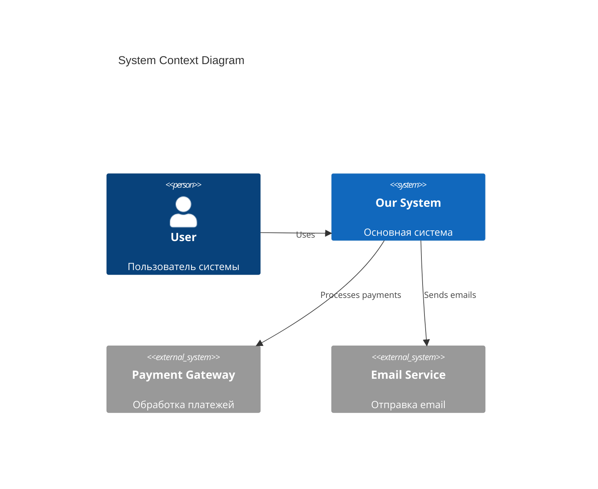
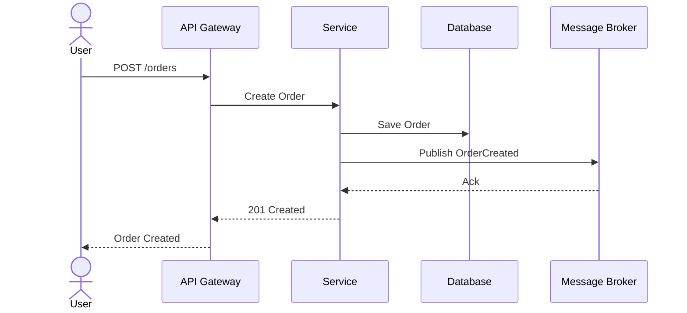
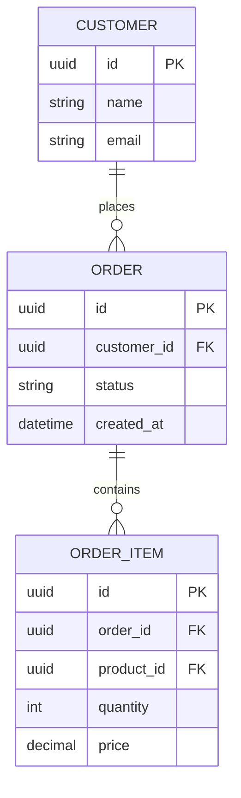
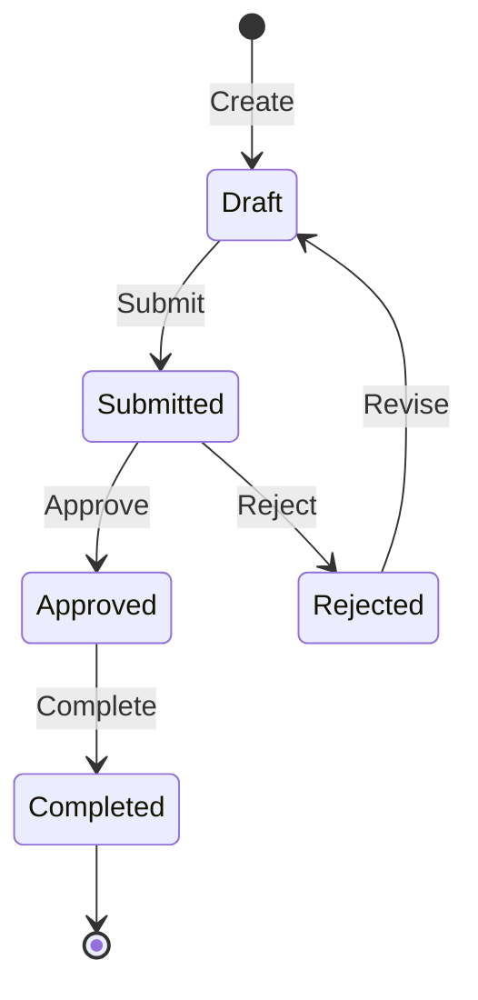
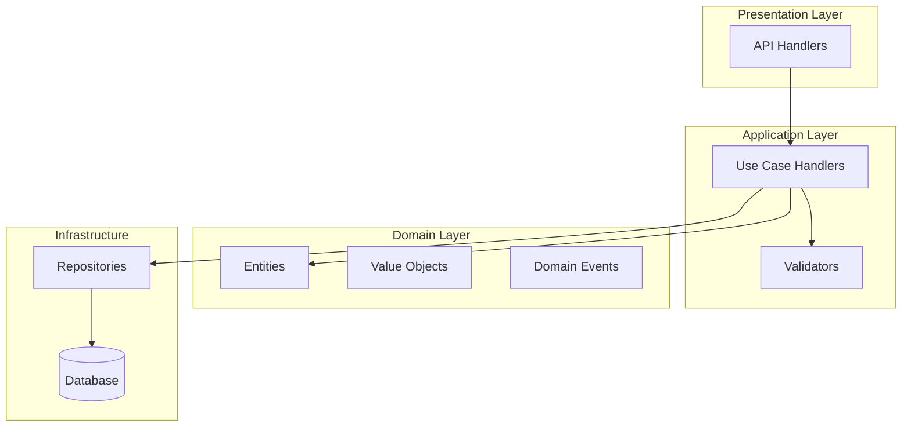

# Diagram Creator

Специалист по созданию архитектурных диаграмм.

## C4 Model

### PlantUML C4 (Context)

```plantuml
@startuml
!include https://raw.githubusercontent.com/plantuml-stdlib/C4-PlantUML/master/C4_Context.puml

Person(user, "User", "Пользователь системы")
System(system, "Our System", "Основная система")
System_Ext(payment, "Payment Gateway", "Обработка платежей")
System_Ext(email, "Email Service", "Отправка email")

Rel(user, system, "Uses")
Rel(system, payment, "Processes payments")
Rel(system, email, "Sends emails")
@enduml
```

### Mermaid C4 (нативный синтаксис)



## Sequence Diagrams



## ER Diagrams



## State Diagrams (DDD Aggregate Lifecycle)



## Component / Flowchart



## Другие инструменты

- **Structurizr DSL** — code-as-architecture, интеграция с C4
- **D2** — декларативные диаграммы, автоматический layout

## Вывод

После создания диаграммы:
1. Сохранить в `docs/diagrams/`
2. Добавить ссылку в README
3. Обновить ADR если есть связь
